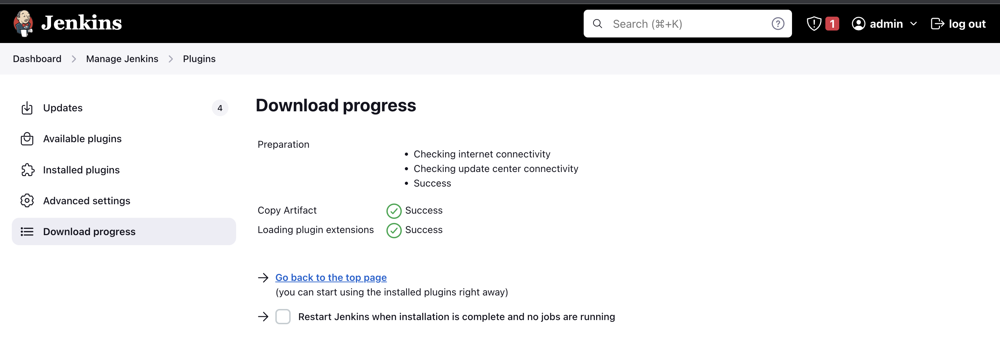
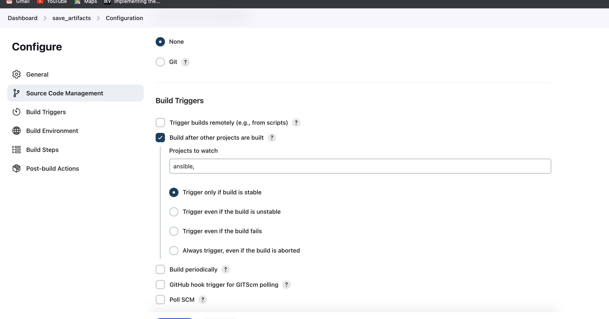
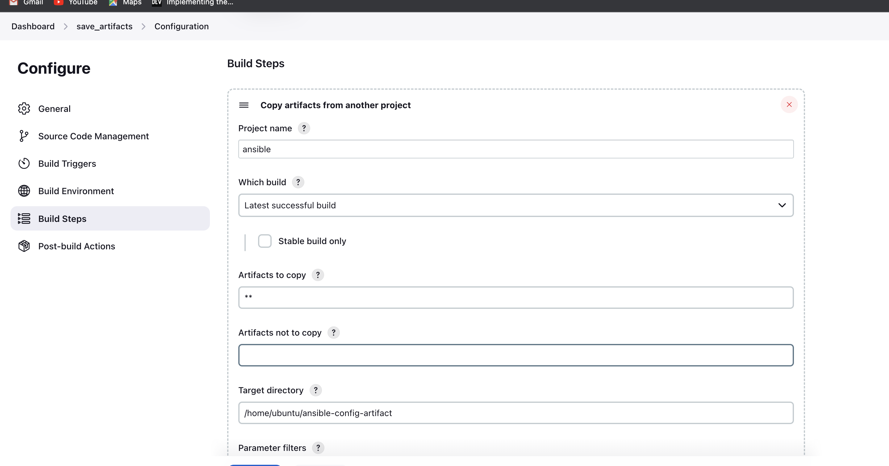
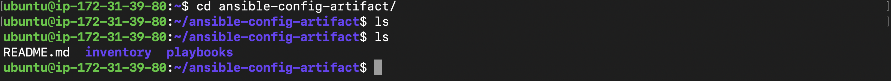
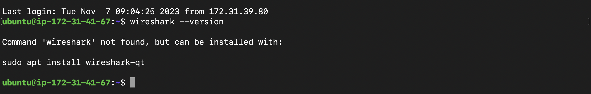
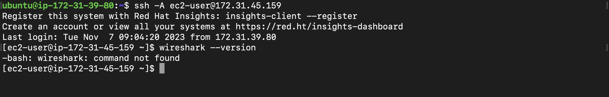
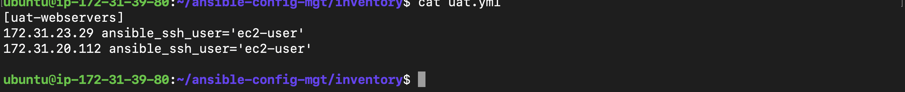
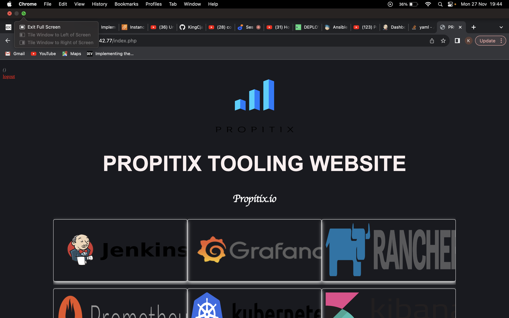
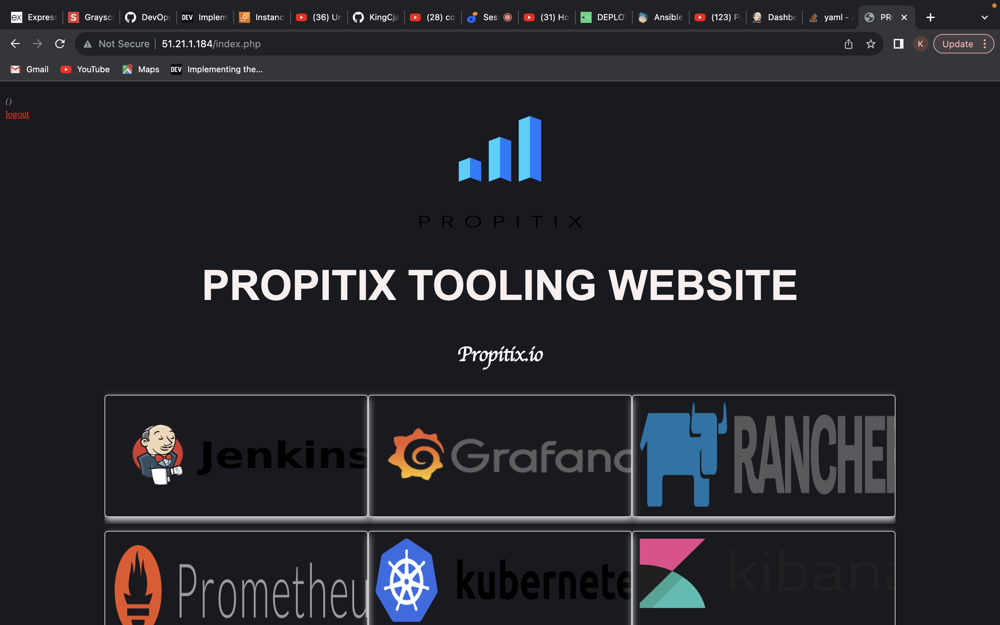

# Ansible Refactoring, Assignments & Imports 

Here, we elevate our ansible skills through refactoring, assignments and imports, optimizing our automation workflows wth advanced techniques.


## Ansible Refactoring & Static Assignments (Imports and Roles)

In this project, we will continue working with `ansible-config-mgt` repository and make some improvements of our code. Now we need to refactor our Ansible code, create assignments and learn how to use the imports functionality. Imports allow to effectively re-use previously created playbooks in a new playbook - it allows us to organize our tasks and reuse them when needed. 

## Code Refactoring

Refactoring is a general term in computer programming. It means making changes to the source code without changing expected behavior of the software. The main idea of refactoring is to enhance code readability, increase maintainability and extensibility, reduce complexity, add proper comments without affecting the logic.

In our case, we will move things around a little bit in the code, but the overall state of the infrastructure remains the same. 

## Refactor ansible code by importing other playbooks into site.yml

**Step 1 - Jenkins job enhancement

We first make some changes to our Jenkins job - now every new change in the codes creates a separate directory which is not very convinient when we want to run some commands from one place. Besides, it consumes space on Jenkins server with each subsequent change. Let us enhance it by introducing a new Jenkins project/job - we will require `Copy Artifacts` plugin.

1. Go to your `Jenkins-Ansible` server and create a new directory called `ansible-config-artifact` - we will store there all artifacts after each build.

`sudo mkdir /home/ubuntu/ansible-config-artifact`

2. Change permissions to this directory, so Jenkins could save files there -

`chown 0777 /home/ubuntu/ansible-config-artifacts`

3. Go to Jenkins web console ->Mannage Jenkins -> Manage Plugins -> on `Available` tab search for `Copy Artifact` and install this plugin without restarting Jenkins.



4. Create a new Freestyle project and name it `save_artifacts`.

5. This project will be triggered by completion of existing `ansible` project. Configure it accordingly:




**Note**: You can configure number of builds to keep in order to save space on the server, for example, you might want to keep only last 2 or 5 build results. You can aslo make this change to your `ansible` job.

6. The main idea of `save_artifacts` project is to save artifacts into `/home/ubuntu/ansible-config-artifact` directory. To achieve this, create a `Build` step and choose `Copy artifacts from other project`, specify `ansible` as a source project and `/home/ubuntu/ansible-config-artifact` as a target directory.




7. Test your set up by making some changes in README.md file inside your `ansible-config-mgt` repository(right inside `master` branch).

If both the Jenkins job have completed one after another - you shall see your files inside `/home/ubuntu/ansible-config-artifact` directory and it will be updated with every commit to your `main` branch.



**Step 2: Refactor Ansible code by importing other playbooks into `site.yml`**

Before starting to refactor the codes, ensure that we pull down the latest code from main branch , and create a new branch, name it `refactor`. 


Most Ansible users leran the one-file approach first. However, breaking tasks up into different files is an excellent way to organize complex sets of tasks and reuse them. 

Lets see code re-use in action by importing other playbooks. 

1. Within `playbooks` folder, create a new file and name it `site.yml` - ***This file will now be considered as an entry point to the entire infrastructure configuration.*** Other playbooks will be included here as reference. In other words, `site.yml` will be a parent to all other playbooks that will be developed including `common.yml` that we created previously. 

2. Create a new folder in root of repository and name it `static-assignments`. The **static-assignments** folder is where all the other children playbooks will be stored. This is merely for easy organization of our work. It's not Ansible specific concept, therefore you can choose how you want to organize your work. 

3. Move `common.yml` file into newly created `static-assignments` folder.

4. Inside `site.yml` file, import `common.yml` playbook.

Copy below code 

```php
---
- hosts: all
- import_playbook: ../static-assignments/common.yml
```

The code above uses built in ***import_playbook*** Ansible module.

Your folder structure should look like this;

Copy below code

```php
├── static-assignments
│   └── common.yml
├── inventory
    └── dev
    └── stage
    └── uat
    └── prod
└── playbooks
    └── site.yml

```

5. Run `ansible-playbook` command against enviroment

Since you need to apply some tasks to your `dev` servers and `wireshark` is already installed - we create another playbook under `static-assignments` and name it `common-del.yml`. In this playbook, configure deletion of `wireshark` utility.

Copy below code
```php
---
- name: update web, nfs and db servers
  hosts: webservers, nfs, db
  remote_user: ec2-user
  become: yes
  become_user: root
  tasks:
  - name: delete wireshark
    yum:
      name: wireshark
      state: removed

- name: update LB server
  hosts: lb
  remote_user: ubuntu
  become: yes
  become_user: root
  tasks:
  - name: delete wireshark
    apt:
      name: wireshark-qt
      state: absent
      autoremove: yes
      purge: yes
      autoclean: yes

```

Update `site.yml` with `import_playbook: ../static-assigments/common-del.yml` instead of `common.yml` and run it against `dev` servers:

`cd /home/ubuntu/ansible-config-mgt/`

`ansible-playbook -i inventory/dev.yml playbooks/site.yml`

Make sure that `wireshark` is deleted on all the servers by running `wireshark --version`





## Configure uat webservers with a role webserver

**Step 3 -  Configure UAT Webservers with a role 'Webserver'**

We have our clean and nice `dev` enviroment, we put it aside and configure 2 new Web Servers as `uat`. We could write tasks to configure Web Servers in same playbooks, but it would be too messy, instead, we use a deicated `role` to make our configuration reuseable. 

1. Launch 2 fresh EC2 instances using RHEL 8 image, we will use them as our `uat` servers, so we give thmem names accordingly - `Web1-UAT` and `Web2-UAT`.

**Tip**: For now we stop the other EC2 instances which are not in use to avoid incurring extra charges. We only need 2 new RHEL 8 servers as Web Severs and 1 existing `Jenkins-Ansible` server up and running. 

2. To create a role, you must create directory called `roles/`, relative to the playbook file or in `/etc/ansible` directory.

There are two ways to create this folder structure:

- Use an Ansible utility called `ansible-galaxy` inside `ansible-config-mgt/roles` directory(you need to create `roles` directory upfront)

`mkdir roles`

`cd roles`

`ansible-galaxy init webserver`

- Create the directory/files structure manually

**Note**: You can choose either way, but since you store all your codes in GitHub, it is recommended to create folders and files there rather than locally on `Jenkins-Ansible` server.

The entire folder structure should look like below, but if you create manually- you can skip creating `tests`, `files` and `vars` or remove them if you used `ansible-galaxy`

Copy below code 

```php
└── webserver
    ├── README.md
    ├── defaults
    │   └── main.yml
    ├── files
    ├── handlers
    │   └── main.yml
    ├── meta
    │   └── main.yml
    ├── tasks
    │   └── main.yml
    ├── templates
    ├── tests
    │   ├── inventory
    │   └── test.yml
    └── vars
        └── main.yml

```

After removing unnecessary directories and files, the `roles` structure should look like this 

```php
└── webserver
    ├── README.md
    ├── defaults
    │   └── main.yml
    ├── handlers
    │   └── main.yml
    ├── meta
    │   └── main.yml
    ├── tasks
    │   └── main.yml
    └── templates

```

3. Update your inventory `ansible-config-mgt/inventory/uat.yml` file with the IP addresses of your 2 UAT Web servers

**NOTE**: Ensure you are using ssh-agent to ssh into the Jenkins-Ansible instance as we have done in previous project;

Copy below code 
```php
[uat-webservers]
<Web1-UAT-Server-Private-IP-Address> ansible_ssh_user='ec2-user'
<Web2-UAT-Server-Private-IP-Address> ansible_ssh_user='ec2-user'

```



4. In `/etc/ansible/ansible.cfg` file uncomment `role_path` string and provide a full path to your roles directory `roles_path = /home/ubuntu/ansible-config-mgt/roles`, so Ansible could know where to find configured roles. Also uncomment your `inventory` to a full path `inventory = /home/ubuntu/ansible-config-mgt/roles`.

5. We add some logic to the webserver role. Go into `tasks` directory, and within the `main.yml` file, start writing configuration tasks to do the following :

- Install and configure Apache (httpd service)
- Clone **Tooling website** from GitHub .....
- Ensure the tooling website code is deployed to `/var/www/html` on each of 2 UAT Web servers.
- Make sure `httpd` service is started.

Your `main.yml` may consist of the following tasks:

```php
---
- name: install apache
  become: true
  ansible.builtin.yum:
    name: "httpd"
    state: present

- name: install git
  become: true
  ansible.builtin.yum:
    name: "git"
    state: present

- name: clone a repo
  become: true
  ansible.builtin.git:
    repo: https://github.com/<your-name>/tooling.git
    dest: /var/www/html
    force: yes

- name: copy html content to one level up
  become: true
  command: cp -r /var/www/html/html/ /var/www/

- name: Start service httpd, if not started
  become: true
  ansible.builtin.service:
    name: httpd
    state: started

- name: recursively remove /var/www/html/html/ directory
  become: true
  ansible.builtin.file:
    path: /var/www/html/html
    state: absent

```

## Reference webserver role

**Step 4 - 'Webserver' role**

Within the `static-assignments` folder, create a new assignment for **uat-webservers** `uat-webservers.yml`. This is where you will reference the role 

Copy below code 
```php
---
- hosts: uat-webservers
  roles:
     - webserver

```

Remember that the entry point to your ansible configuration is the `site.yml` file. Therefore, you need to refer your `uat-webservers.yml` role inside `site.yml`

So, we should have this in the `site.yml`

Copy below code 

```php
---
- hosts: all
- import_playbook: ../static-assignments/common.yml

- hosts: uat-webservers
- import_playbook: ../static-assignments/uat-webservers.yml
```

**Step 5 - Commit & Test**

Commit your changes, create a Pull Request and merge the to `main` branch, make sure webhook triggered two consequent Jenkins jobs, they ran successfully and copied all the files to your `Jenkins-Ansible` server into `home/ubuntu/ansible-config-mgt/` directory.

Now run the playbook against your `uat` inventory and see what happens:

**NOTE**: Before running your playbook, ensure you have tunneled into the `Jenkins-Ansible` server via ssh-agent.  

`cd /home/ubuntu/ansible-config-mgt`

`ansible-playbook -i /inventory/uat.yml playbooks/site.yml`

We should be able to see both our UAT Web servers configured and we can try to reach them from the browser;

`http://<Web1-UAT-Server-Public-IP-or-Public-DNS-Name>/index.php`



or 

`http://<Web2-UAT-Server-Public-IP-or-Public-DNS-Name>/index.php`

