# Initialising a Repository and Making commits 

We should first start by defining Git.

## What is Git?

Git is a distributed version control system. ***Distributed*** in the sense that it allows developers make their own copy of the central repository unlike other Version control system e.g SVN.

## Initialiazing a Git Repository

Before initializing a git repo you must have installed git in your computer.

To check if you already have git pre-installed like Mac, run the command 

`git` or `which git`(to show you the location of the git). If not pre-installed, download and install git from in your computer.

To initialize a git repo, take the following steps:
- Open a terminal on your computer eg Termuis, Terminal
- Create your working folder/directory eg Git_Project using the `mkdir Git_Scheme`
- Move into your working folder, run `cd Git_Scheme` command
- While you are inside the folder, run the command `git init`

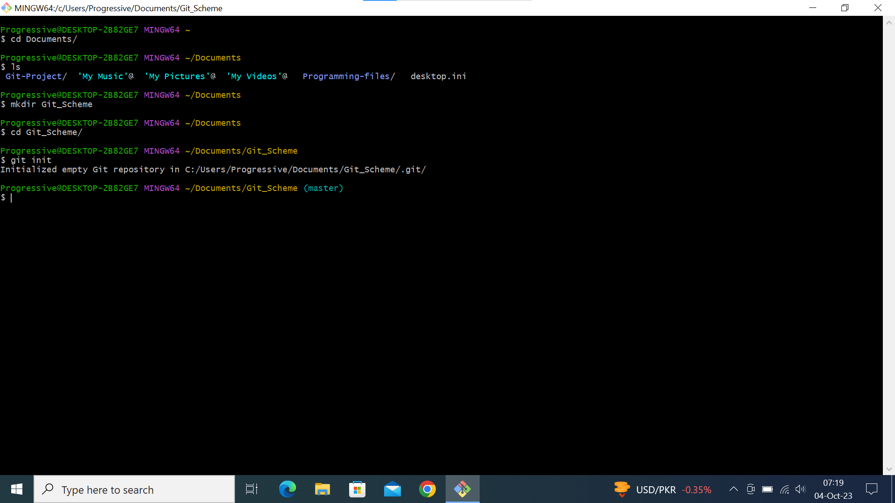

## Making your first Commit

After we've successully created a working directory and initialized it a git repository. Now we make our first commit.

Commit is saving changes you made in your file. Changes can be modifying,adding or deleting files or text.

When you make a commit, git takes a snapot of the current state of your repository and saves a copy of the .git folder inside your working directory.

Now lets make our first commit with the followwing steps:
- Inside your working directory, creat a file .txt using the command `touch file1.txt`
- Write a sentence of your choice inside the file, and save the changes.
- Add your changes to git staging area by running the command `git add`
- To commit your changes to git, run the command `git commit -m "first commit"`

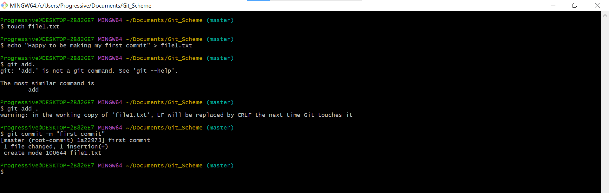

The -m flag provides a commit message. The message should be descriptive as possible to provide context about changes made during the commit.

# Working with Branches 

Git branches are effectively a pointer to a snapshot of your changes. When you want to add a new feature or fix a bug(no matter how big or how small)you spawn a new branch to encapsulate your changes.

A branch is a pointer to one specific commit, while a commit is a snapshot of your repository at a specific point in time.

Git branch is commomly used to develop new feature of an application.

## Creating your first git Branch

To create a new branch, run the command: `git checkout -b`

The -b flag helps you to creat and change into the new branch.

Now lets make our first branch with the following steps:
- Having made your commit previously
- Make a branch by runnin the command `git checkout -b New-branch`

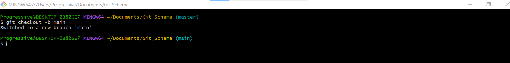

## Listing your branches 

Run the command `git branch` to list all the branches on your local repository.

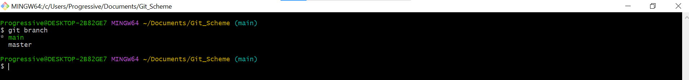

## Change into Old Branch

To change into an existing or old branch, run the command:

`git checkout`

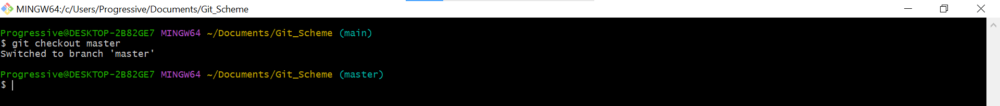

## Merging a Branch into another Branch

To merge two branches, Branch A and Branch B i.e we want to add the content of Branch B into A.

First we change into Branch A and run the command below:

`git merge B`

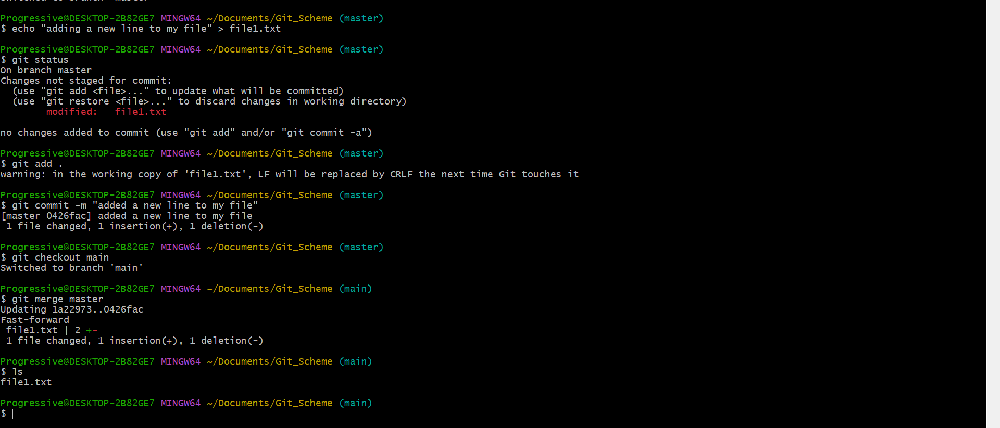

## Deleting a git branch

When new feature is added to an application, it's often done in a feature branch. Usually this feature branch is deleted when the code must have tested and merged into staging or dev enviroment depending on the branch strategy of the team.

Git branch can be deleted by running the following command:

`git branch -d`

There are so many other attributes we can run on branches in git. To learn more, type the command:

`git branch --help`

## Collarboration and Remote Repositories

We afore mentioned that git is used in collaboration among remote team(developers residing in different location). How can developers working remotely collaborate(make changes, adding, updating etc)on the same code base since we currently have our code in our local computer?

This is where __github__ comes in. Github is a web based platform where git repositories are hosted. By hosting our local git repository on github, it becomes available in the public internet(it's possible to create a private  repository as well). Anyone can now access it.

Remote teams can now view,update and make changes to the same repository.

## Creating a Github Account

- step 1: Head over to ***join github.com***

- step 2: Enter your username,password and email.

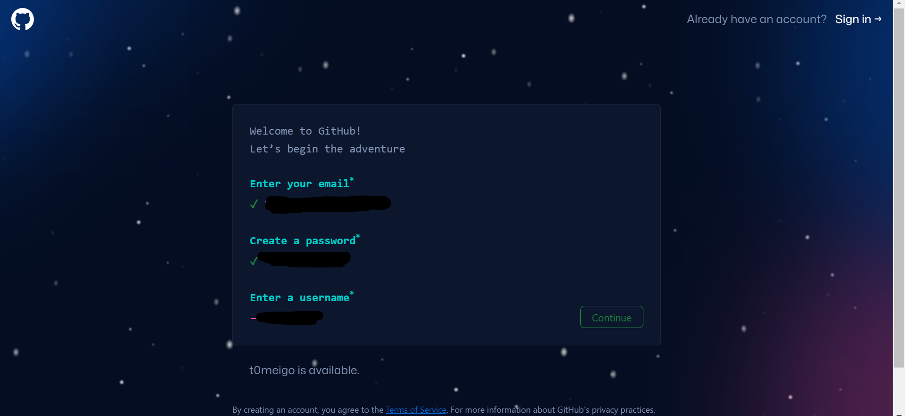

- step 3: Next click on the verify button to verify your identity.

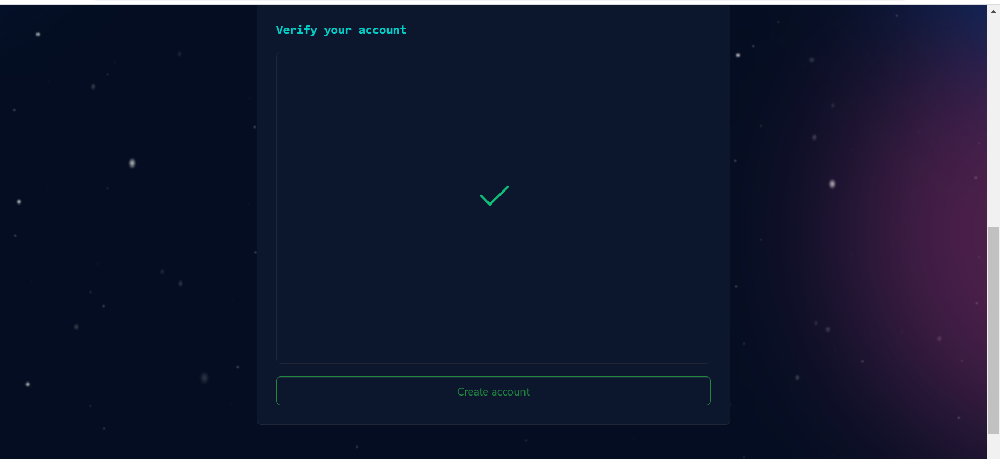

- step 4: Click on the ***Create account*** button to create your account.

- step 5: An activation code will be sent to your email, enter the code in the textboxes provided and click continue.

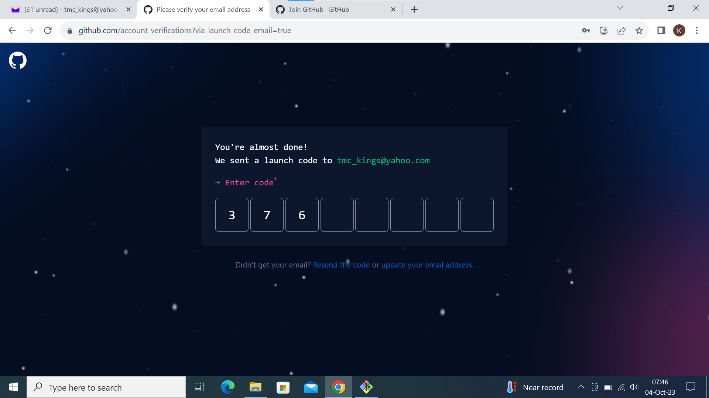

- step 6: A list of github plans will be shown to you, click ***continue for free***

## Creating your First Repository

- step 1: Click on the plus sign st the top right corner of your github account. A drop down menu will appear, click on new repository.

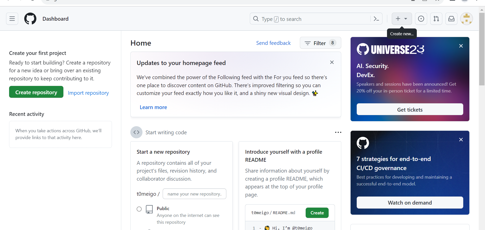

- step 2: fill out the form by adding unique repository name, description and ticking the box to add Readme.md file.

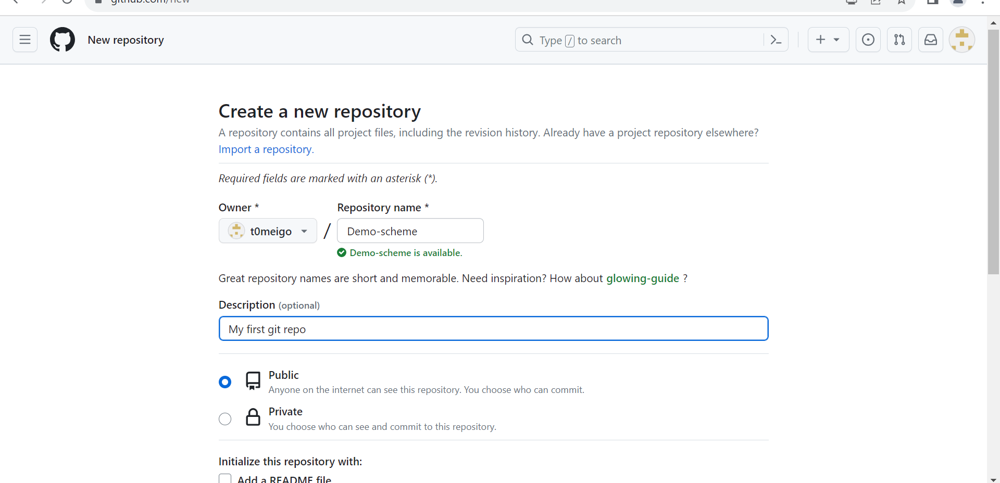

- step 3: Click the green button below to create your repository.

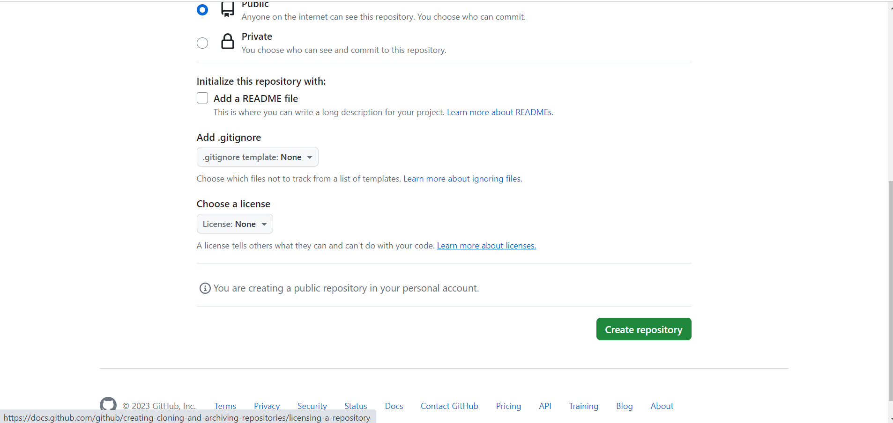

## Pushing your Local git Repository to your Remote github Repository

Having created our work or job in our local git repository, to make it accessible to our co-developers using the github account and github repository we created above. 

We first send the copy of our work to our github repository withe following steps:

- Add a remote repository to the local repository by running the command;

`git remote add origin <link>`

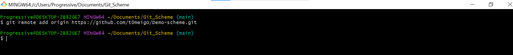

To get the link, click on the green button code, copy the link as shown below;

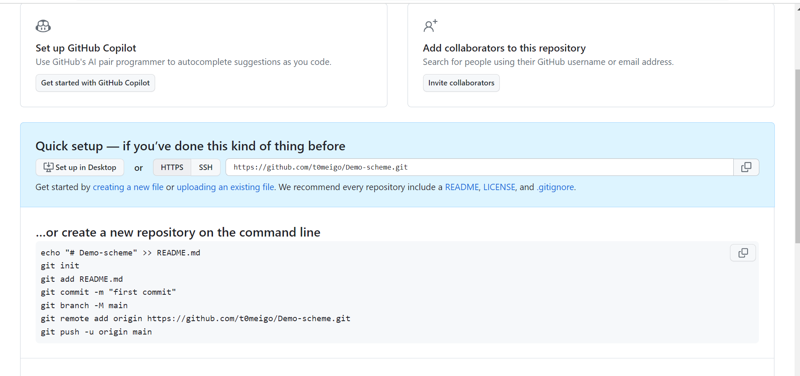

- After commiting your changes in your local repo. You push the content to the remote repo by running the command below:

`git push origin <branch name>` (in this case branch,name is main)

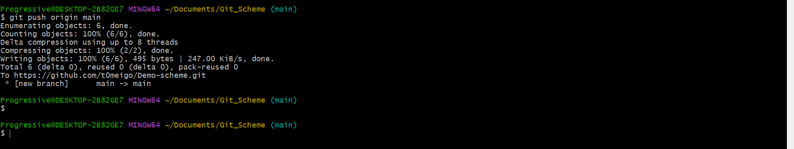

The word origin refers to your remote repo link, it evaluates to the remote repo url. It can be any word you choose.

## Cloning Remote Git Repository

After we've successfully added a remote git repository and pushed our work or job in the local repository. Our co-developers can now make contributions on the work.

For them to be able to do this, it's best practice to make a copy of the work locally in his/her local machine, creates a branch where he/she can make all modifications he/she sees fit.

`git clone` command helps you create a copy of a work or job locally in your local machine.

The git clone command helps us make a copy of remote repository in our local machine. See it as a git tool for downloading remote repository into our local machine. The command is as follows:

On another local machine as seen below, is a mac terminal, we get to clone a remote git repository we created above and can modify as we want in the Mac terminal.

`git clone <link from the remote repository>`

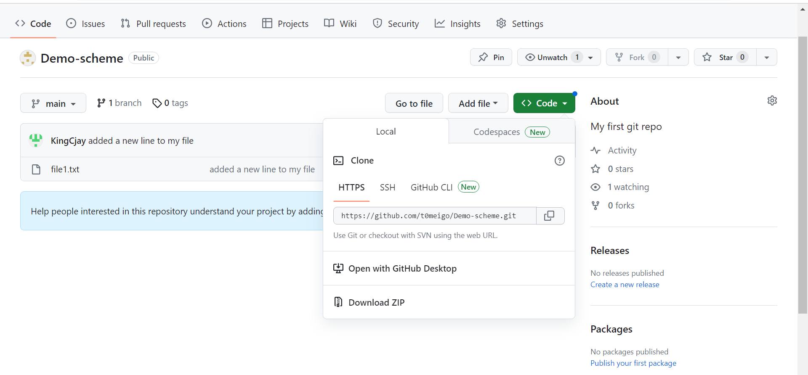

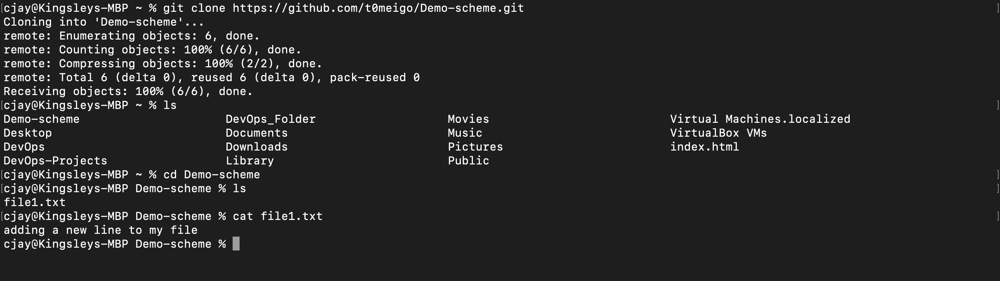

## Branch Management and Tagging

### Introduction to Markdown Syntax

Markdown Syntax is a lightweight markup language that is widely used for formatting plain text. It allows you to add formatting elements to your texts without using complex HTML or other formatting languages. Markdown is commonly used for creating documents,README files,forum posts, and even web pages. 

Readup on the markdown syntax elements on ***markdown documentation*** but to mention a few;
- Headings: Denoted by #
- Emphasis: Denoted by * and _
- Lists: Denoted with numberings 1,2,3
- Links: Denoted with the symbol [] and ()
- Images:Denoted with the symbol 
- Code: Denoted with the symbol ``