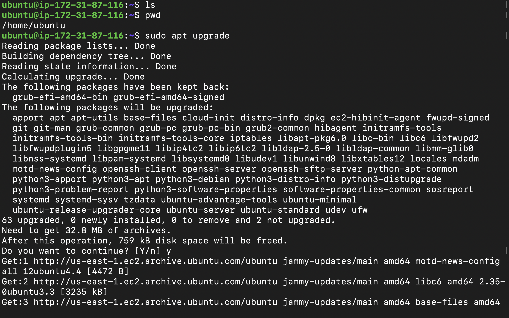
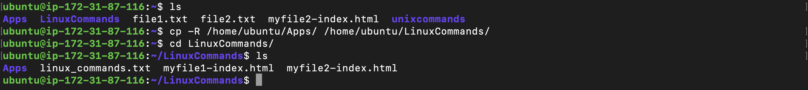
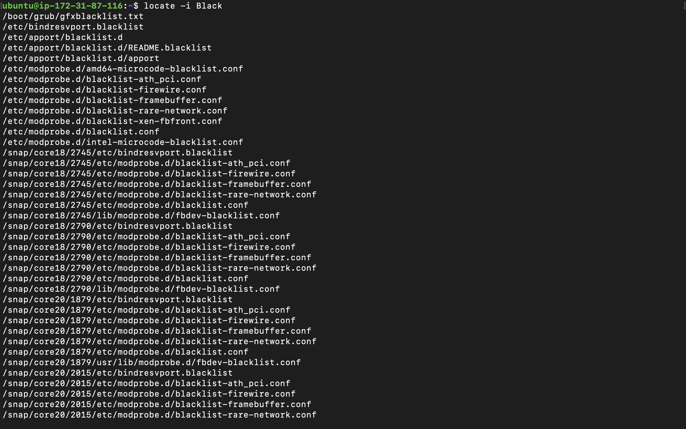
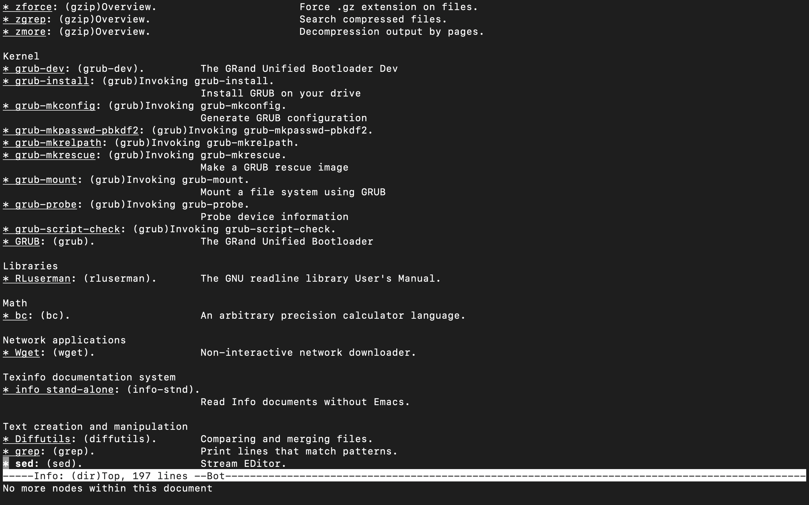

# Introduction to Linux and basic commands 

Linux is a family of open-source Unix operating system based on the Linux Kernel. As well include Red Hat,Debian,openSUSE,Fedora,and Ubuntu.

## What is Linux command?

A linux command is a program or utility that runs on the CLI- a console that interacts with the system via texts and processes. It's similar to the Command Promt application in Windows and the Terminal application in Mac.

Linux commands are executed on Terminal by pressing Enter at the end of the line. The commands perform various tasks. They are case sensitive, and are of three parts; CommandName(the rule that you want to perform), Option or Flag(modifies a commands operations and invoked by hypens"-"or double hypens "--") and Parameter or argument(specifies any necessary information for the command).

## Prerequisites

- Cloud Service Providers; AWS,Azure,GCP,etc.
- Launch a Linux instance on ubuntu(prefarbly).
- Launch ubuntu on killercoda.com

## File Manipulation

### 1. `sudo` command:

Short for superuser do. Lets you perform tasks the require administrative or root permissions. 

`sudo apt upgrade` 

### 2. `pwd` command:

Used to find the path of your Present Working Directory. Simply entering pwd will return full current path - a path of all the directories that starts with a forward slash(/). 

### 3. `ls` command:

The ls command lists files and directories within a system/interface. Running it without a flag will show current working directory's content.

`ls`

Here are some Options for the ls command:

`ls -R`

lists all the files in the subdirectories 

`ls -a`

shows hidden files in addtion to the visible ones

`ls -lh`

shows the file sizes in easily readable formats such as MB.GB and TB.

### 4. `touch` command:

The touch command allows you to create an empty file.

`touch myfile1-index.html`

### 5. `cat` command:
 
The cat command lists,combines and writes  file content to the standard output.

`cat myfile1-index.html`

Other ways to use cat command 

`cat file1.txt file2.txt > file3.txt`

Merges/combines file1.txt and file2.txt and stores the output in file3.txt

`tac file3.txt`

displays content in reverse order.

### 6. `cd` command: 

This command is used to navigate through the linux files and directories. Depending on your current working directory, it reqires the full path or the directory name.

Running this command without an option takes you to the home folder.

This takes you into the LinuxCommands directory:

`cd /home/ubuntu/LinuxCommands`

`cd` alone takes yo back to the home folder.

`cd`

`cd ..` takes you one folder back from the current directory

`cd ..`

`cd -` takes you one folder front from the current directory

`cd ~`

### 7. `mkdir` command:

The mkdir command is used to create one ot multiple directories at once and set permissions for each of them.

`mkdir Apps`

### 8. `rmdir` command:

The rmdir is used to permanently delete an empty directory.

For example, you want to remove an empty subdirectory and its main folder;

`rmdir -p Apps/Stores`

### 9. `rm` command:  

The rm command is used to delete files within a directory.

`rm file1.txt`

To remove multiple files, enter the following command:

`rm file1.txt file2.txt file3.txt`

### 10. `mv` command:

The mv command is primarily used to move and rename files and directories.  

Simply type mv followed by the filename and destination directory.

`mv myfile1-index.html /home/ubuntu/LinuxCommands`

### 11. `cp` command:

Use the cp command to copy files or directories and their contents.

To copy one file from the current directory to another, enter cp followed by the file name and the destination directory. For example:

`cp myfile2-index.html /home/ubuntu/LinuxCommand`

To copy files to a directory, follow the format below:

`cp file1.txt file2.txt /home/ubuntu/Apps`

To copy an entire directory, pass the -R flag before typing the source directory, followed by the destination directory.

`cp -R /home/ubuntu/LinuxCommands /home/ubuntu/Apps`

### 12. `locate` command:

This command can find a file in the databse system.

However, adding -i argument will turnoff case sensitivity, so you can search for a file even when you don't remember the exact name 

The command is mosttimes have to be installed:
`sudo apt install plocate -y`

`locate -i black`

### 13. `find` command:

The find command is used to search for files within a specific directory and perform specific operations.

For example, you want to look for a file called myindex.html within the home directory and its subfolders:

`find /home -name myfile1-index.html`

### 14. `grep` command:

This command grep or global regular expression print lets you find a word by searching through large log file.

For example, you want to search for the word black in the file1.txt file:

`grep black file1.txt`

### 15. `df` command:

This command df gives report of the system's disk space usage, shown in percentage and kilobyte(KB).

`df`

For example, enter the following command if you want to see the current directory's system disk space usage in human-readable format:

`df -h`

### 16. `du` command:

If you want to check how much space a file or diectory takes up, use the du command. You can run this command to identify which part of the system uses the storage excessively.

You must always specify the directory path when using du command. For example:

`du /home/ubuntu/LinuxCommands`

### 17. `head` command: 

The head command allows you to view the first ten(which can be changed by adding an option) lines of a text. It's also used to output piped data to the CLI.

`head myfile1-index.html`

### 18. `tail` command:

The tail command allows us to view the last ten lines of a text. It allow users to check whether a file has a new data or to read error messages.

`tail myindex.html`

### 19. `info` command:

This command gives you an meaning and function of a command.

`info ls`

### 20. `which` command:

This command is used to locate executable file associated with the given command by searching it in the path enviroment.

`which sudo`

### 21. `clear` command:

This command with shortcut CTRL + L clears the terminals screen and brings the command line on top of the terminal.

`clear`

### 22. `diff` command:

Short for difference, the diff command compares two contents of a file line by line. After analyzing them, it will display the parts that do not match.

Programmers often use the diff command to alter a program instead of rewriting the entire source code.

`diff file1.txt file2.txt`

### 23. `tar` command:

The tar command archieves multiple files into a TAR file, more like the ZIP command.

For instance, you want ot create a new TAR archive named myfilearchive.tar in the /home/ubuntu directory:

`tar -cvf myfile1archive.tar /home/ubuntu`

## File Permission and Ownership

### 24. `nano,vi,jed` commands:

Linux allows users to edit and manage files via text editors such as nano,vi and jed.

The nano command denotes keywords and can work with most languages. 

To use nano on a file, enter:

`nano myfile1index.html`

The vi uses two operating modes to work -insert and command. insert is used to edit and creat text while the command performs operations, such as saving,opening,copying and pasting files.

To use vi on a file, enter:

`vi file1.txt`

Jed has to be installed before using.

### 25. `kill` command:

The kill command is used to terminate an unresponsive program manually. It will signal the misbehaving application and instruct them to close the processes.

To kill a program, you must know its process identification number(PID). If you don't know the PID, run the following command:

`ps ux`

After knowing what signal to use and the program's PID, enter the following syntax:

`kill pid` in this case the number 21989 is the PID 

There are 64 signals we can use, but the two most commonly used are:

SIGTERM which requests a program to stop running and gives it some time to save all of its progresss. SIGKILL forces program to stop and you will lose unsaved progress.

### 26. `wget` command:

This command line lets you download files from the internet. 

The wget command retrieves files using HTTP,HTTPS and FTP protocols. It can perform recurssive downnload which transfer website parts by following directory structures and links, creating a local versions of the web pages.

To use, enter the following command:

`wget https://github.com/startbootstrap/startbootstrap-grayscale/archive/gh-pages.zip`

### 27. `zip, unzip` commands:

The zip command is used to compress your files into a ZIP file which choses the best compression ratio.

The zip command is also useful for archiving files and directories and reducing disk usage.

To use it, enter the following syntax:

`zip zipfile file1.txt file2.txt`

To compress a file (file1.txt) into archive.zip in the current directory:

`zip archive.zip file1.txt`

On the other hand, the unzip command extracts the zipped files from the archive.zip in the current directory

To unzip a file called archive.zip in the current directory:

`unzip archive.zip`

### 28. `man` command:

The man command provides a user manual of any command or utilities you can run in the terminal, including name, description and options. It has same feature with the info command but has more informations about the command.

`man ls`

### 29. `echo` command:

This command displays a line of text or string as a standard output.

`echo "How are you?"`

### 30. `history` command:

The history command list up to 500 previously executed commands, allowing you to reuse them without re-entering. 

 `history`

There are so many other file permisssions and ownership commands like the `chown`,`chmod`,`jobs`,`ping`,`unname`,`useradd`,`userdel`,`apt-get` etc which will be in used classes commence.

It shall be updated when seen a clear use of it for better understanding.