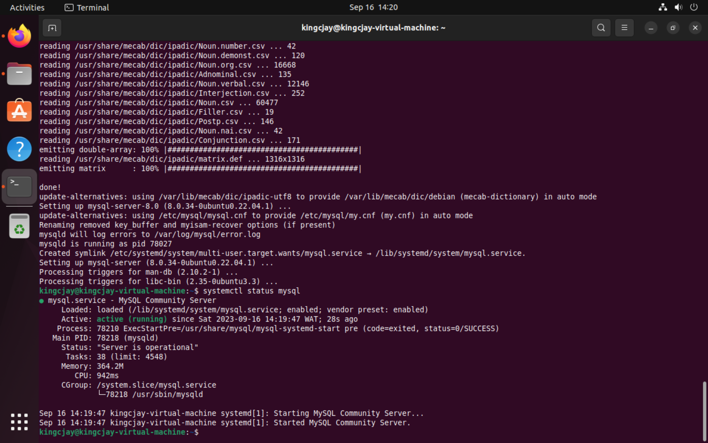
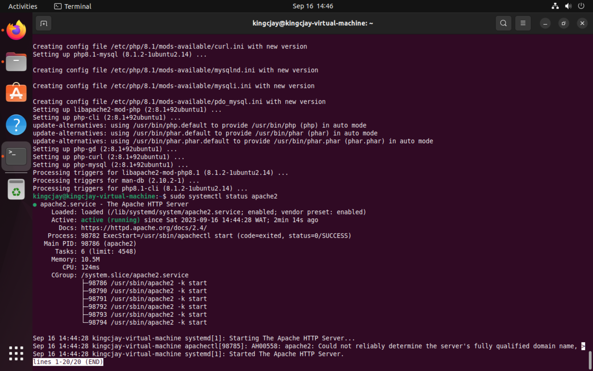
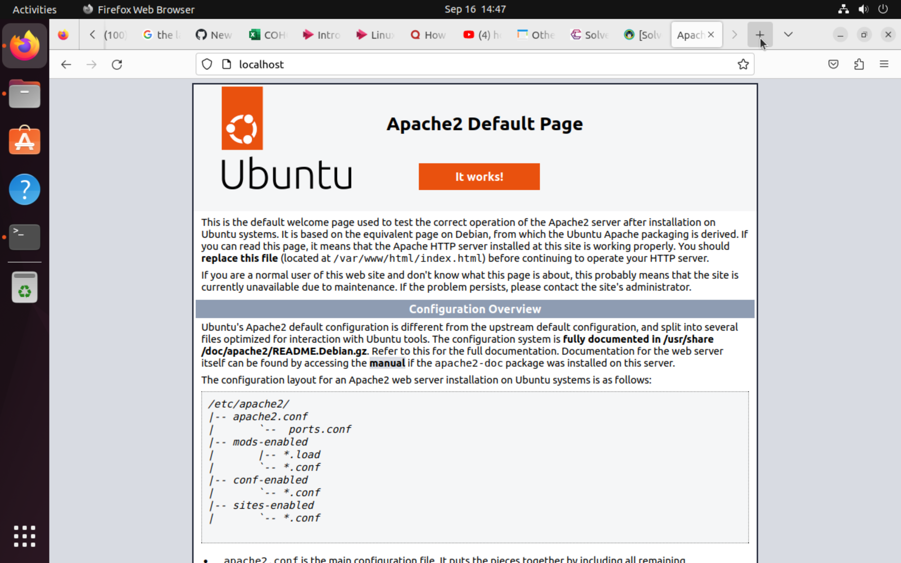

# LAMP STACK IMPLEMENTATION

## Linux Apache Mysql Php; where Linux is the operating system, Apache is the web server,Mysql is the database, and Php is the programming language.

## STEP 1 (In your operating system )

## Installation of a web server 

Update server (an obligatory/best practice)

`sudo apt update`

Install Apache 

`sudo apt install apache2 -y` then -y for the YES prompt question to continue.

## STEP 2 

## Installation of database 

`sudo apt install mysql-server -y`

## Check if mysql is up and running

`systemctl status mysql` 

## To view the database

`sudo mysql`

## STEP 3

## Installation of the Programming Language 

`sudo apt install php` 

Also add/install some extra trivial commands for enabling your server 

`sudo apt install php libapache2-mod-php php-opcache php-cli php-gd php-curl php-mysql`

## Test the server to see if it's active and running

`sudo systemctl status apache2`

## Restart the server 

`sudo systemctl restart apache2`

# Check if your LAMP is up

- Go to your browser and type;
  localhost then go or
  127.0.0.1

  # The result

  