### Automating AWS infrastructure in code (Terraform)

In this project, we automate our AWS infrastructure provisioning and management using Terraform, enabling efficient and scalable deployment of resources with code.

### Automate Infrastructure With IaC using Terraform Part 1

Here we build AWS infrastructure for 2 websites with the power of Infrastructure as Code(IaC).

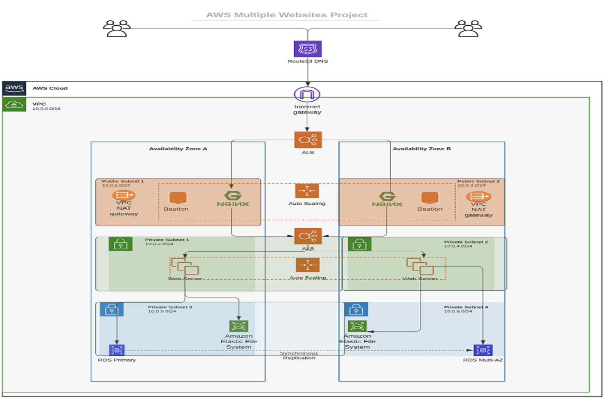

#### Prerequisites before we begin writing Terraform code

- Create an IAM user,name it `terraform`(***ensure that the user has only programatic access to your AWS account***) and grant this user `AdministrationAccess` permissions.
- Copy the secret access key and access key ID. Save them in a notepad temporarily.
- Configure programmatic access from your workstation to connect to AWS using the access keys copied above and a **Python SDK(boto3)**. You must have **Python 3.6** or higher on your workstation.

Configure Python SDK properly either on your Mac terminal or `gitbash` on Windows.

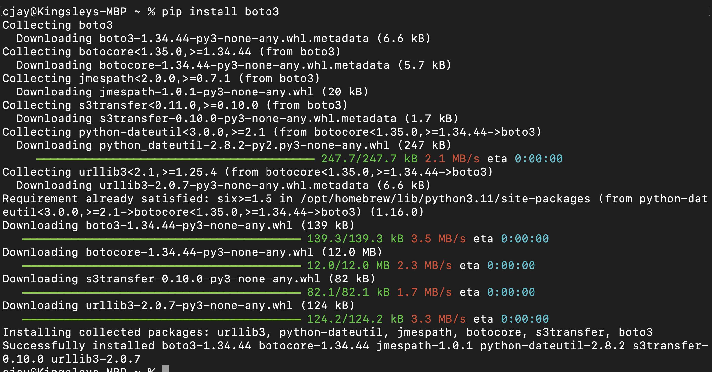

For easier authentification - use **AWS CLI** with `aws configure` command.

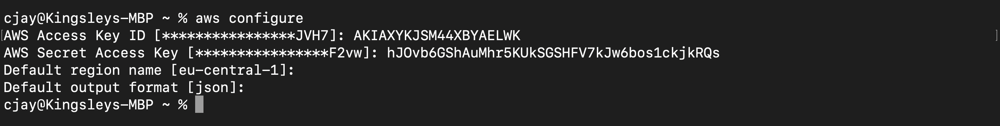

- Create an S3 bucket to store Terraform state file. You can name it something like `<yourname>-dev-terraform-bucket`(***Note:S3 bucket names must be unique within a region partition***). We will use this bucket from Project-17 onwards.
 
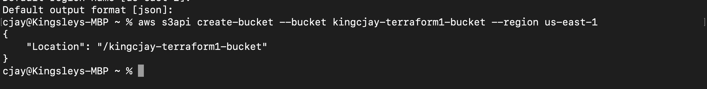

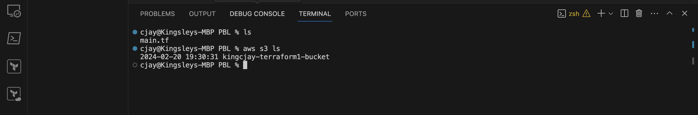

When you have configured authentication and installed `boto3`,make sure you can programmatically access your AWS account by running following commands in `>python`:

Copy Below Code 
```php
import boto3
s3 = boto3.resource('s3')
for bucket in s3.buckets.all():
    print(bucket.name)
```

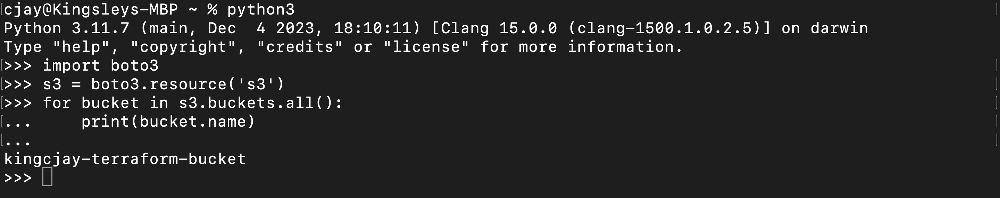

You shall see your previously created S3 bucket name- `<yourname>-dev-terraform-bucket`


#### The secrets of writing quality Terraform code 

- Your understanding of your goal (desired AWS infrastructure end state)
- Your knowledge of the `IaC` technology used(in this case- Terraform)
- Your ability to effectively use up to date Terraform documentation 

Terraform-specific terminologies we should get familiar with while on this project, be sure to understand them and know when to use each of them:

- Attribute
- Resource
- Interpolations
- Argument
- Providers
- Provisioners
- Input Variables 
- Output Variables 
- Module
- Data Source
- Local Values
- Backend
  
Another cocept we must know is `data type`. This is a general programming concept,it refers to how data represented in a programming language and defines how a compiler or interpreter can use the data. Common data types are:

- Integer
- Float
- String
- Boolean,etc.

## Base infrastructur automation (VPC | Subnets)

### VPC | Subnets | Security Groups

Let us create a directory structure 

Open your Visual Studio Code and:

- Create a folder called `PBL`
- Create a file in the folder,name it `main.tf`
- Install HashiCorp Terraform on VSCode (to be able to read the main.tf file)

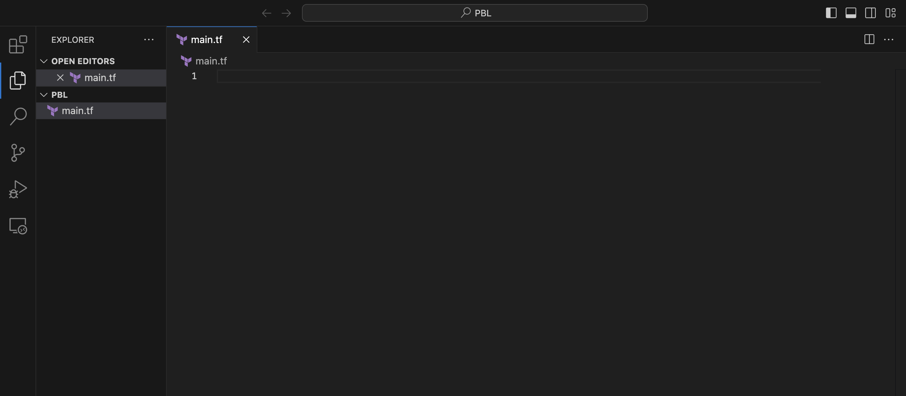

#### Provider and VPC resource section 
Set up Terraform CLI as per this instruction

- Add `AWS` as a provider,and resource to create a VPC in the `main.tf` file.
- Provider block informs Terraform that we intend to build infrastructure within AWS.
- Resource block will create VPC.

Copy Below Code
```php
provider "aws" {
  region = "eu-central-1"
}

# Create VPC
resource "aws_vpc" "main" {
  cidr_block                     = "172.16.0.0/16"
  enable_dns_support             = "true"
  enable_dns_hostnames           = "true"
  enable_classiclink             = "false"
  enable_classiclink_dns_support = "false"
}
```

**Note**: You can change the configuration above to create your VPC in the other region that is closer to you. The same applies to all configuration snippets that will follow.

- We now download necessary plugins for Terraform to work. These plugins are used by `providers` and `provisioners`. At this stage,we only have `provider`in our `main.tf` file. So, Terraform will just download plugin for AWS provider.
- Lets accomplish this with `terraform init` command as seen in the below demonstration.

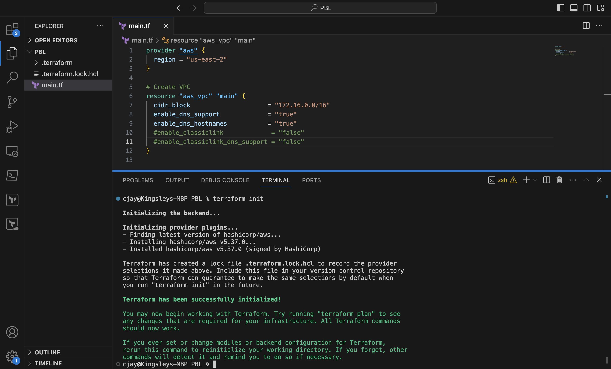

***Observations***:

- Notice that a new directory has been created: `.terraform\...`. This is where Terraform keeps plugins. Generally,it is safe to delete this folder. It just means that you must execute `terraform init` again,to download them.

Next, we create the only resource we just defined `aws_vpc`. But before we do that,we should check to see what terraform intends to create before we tell it to go ahead and create it.

- Run `terraform plan`

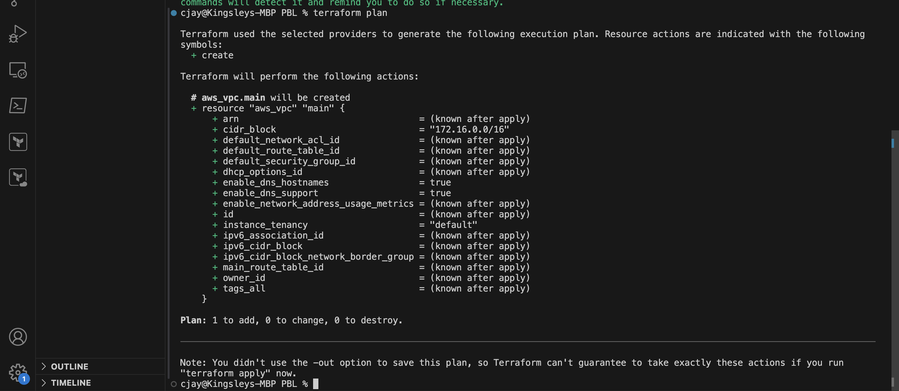

- Then, if you are happy with changes planned,execute `terraform apply`

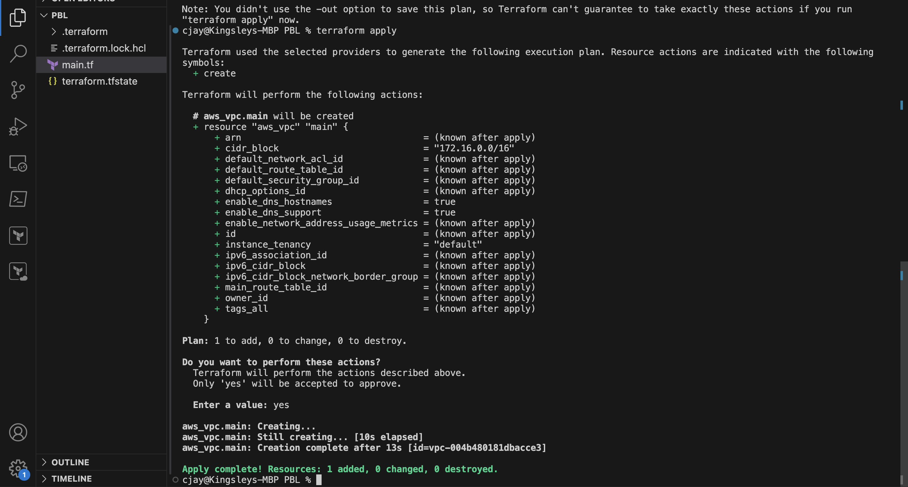

***Observations***: 

1. A new file is created `terraform.tfstate` This is how Terraform keeps itself up to date the exact state of the infrastructure. It reads this file to know what alraedy exists,what should be added,or destroyed based on the entire terraform code that is being developed.
2. Another file gets created during planning and apply. But this file gets deleted immediately. `terraform.tfstate.lock.info` This is what Terraform uses to track,whi is running its code against the infrastructure at any point in time. This is very important for teams working on the same Terraform repository at the same time. The lock prevents a user from executing Terraform configuration against the same infrastructure when another user is doing the same- it allows to avoid duplicates and conflicts. 

Its content is usually like this.(We will discuss more about this later)

Copy Below Code
```php
    {
        "ID":"e5e5ad0e-9cc5-7af1-3547-77bb3ee0958b",
        "Operation":"OperationTypePlan","Info":"",
        "Who":"dare@Dare","Version":"0.13.4",
        "Created":"2020-10-28T19:19:28.261312Z",
        "Path":"terraform.tfstate"
    }
```

It is a `json` format file that stores information about a user:user's `ID`, what operation he/she is doing,timestamp,and location of the `state` file.

### Refactoring bad practice 

#### Subnets resource section

According to our architectural design,we require 6 subnets:

- 2 public
- 2 private for webservers
- 2 private for data layer

We first create 2 public subnets.

Add below configuration to the `main.tf` file:

Copy Below Code
```php
# Create public subnets1
    resource "aws_subnet" "public1" {
    vpc_id                     = aws_vpc.main.id
    cidr_block                 = "172.16.0.0/24"
    map_public_ip_on_launch    = true
    availability_zone          = "eu-central-1a"

}

# Create public subnet2
    resource "aws_subnet" "public2" {
    vpc_id                     = aws_vpc.main.id
    cidr_block                 = "172.16.1.0/24"
    map_public_ip_on_launch    = true
    availability_zone          = "eu-central-1b"
}
```

- We are creating 2 subnets,therefore declaring 2 resource blocks- one for eac of the subnets.
- We are using the `vpc_id` argument to interpolate the value of the VPC `id` by setting it to `aws_vpc.main.id`. This way,Terraform knows inside which VPC to create the subnet. 

Run `terraform plan` and `terraform apply` 

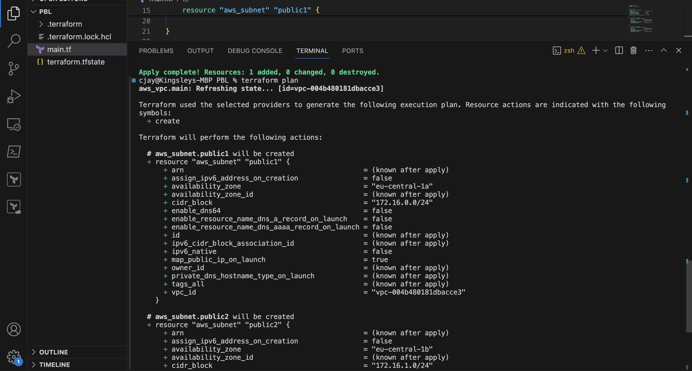

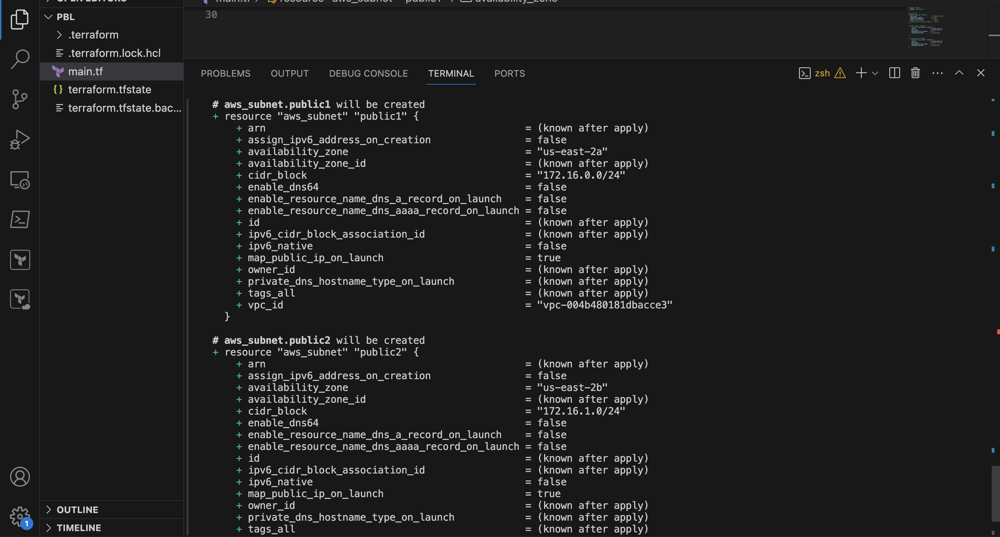

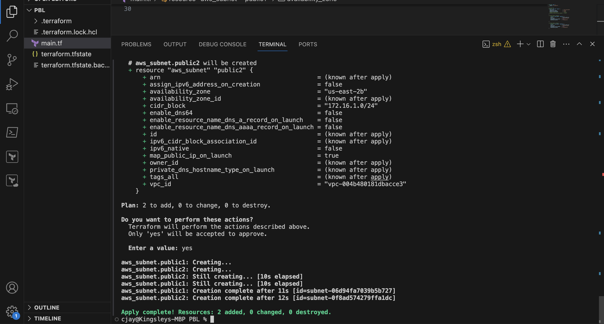

***Observations***:

- Hard coded values: For best practices, both `availability_zone` and `cidr_block` arguments are hard coded. WE should always endeavour to make our work dynamic.
- Multiple Resource Blocks: Having declared multiple resource blocks for each subnet in code, it's a bad coding practice. We need to create a single resource block that can dynamically create resources without specifying multiple blocks. Imagine if we wanted to create 10 subnets,our code would look very clumsy. So,we need to optimize this by introducing a `count` argument.

Now let us improve our code by refactoring it.

***First,destroy the current infrastructure. Since we are still in development,this is totally fine. Otherwise,DO NOT DESTROY an infrastructure that has been deployed to production.***

To destroy whatever has been created run `terraform destroy` command, and type `yes` after evaluating the plan.

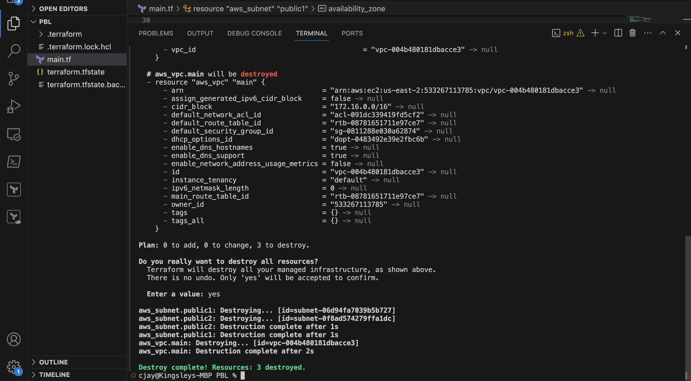

### Fixing The Problems By Code Refactoring

- **Fixing Hard Coded Values**: We will introduce variables and remove hard coding.

    - Starting with the provider block,declare a variable named `region`,give it a default value,and update the provider section by referring to declared variable.
    
    Copy Below Code
    ```php
        variable "region" {
        default = "eu-central-1"
    }

    provider "aws" {
        region = var.region
    }
    ```

    - Do the same to `cidr` value in the `vpc` block, and all the other arguments.

    Copy Below Code
    ```php
        variable "region" {
        default = "eu-central-1"
    }

    variable "vpc_cidr" {
        default = "172.16.0.0/16"
    }

    variable "enable_dns_support" {
        default = "true"
    }

    variable "enable_dns_hostnames" {
        default ="true" 
    }

    variable "enable_classiclink" {
        default = "false"
    }

    variable "enable_classiclink_dns_support" {
        default = "false"
    }

    provider "aws" {
    region = var.region
    }

    # Create VPC
    resource "aws_vpc" "main" {
    cidr_block                     = var.vpc_cidr
    enable_dns_support             = var.enable_dns_support 
    enable_dns_hostnames           = var.enable_dns_support
    enable_classiclink             = var.enable_classiclink
    enable_classiclink_dns_support = var.enable_classiclink

    }
    ```

- **Fixing multiple resource blocks**: Things become tricky here. It's not complex,we are just going to introduce some interesting concepts. Loops&Data sources

Terraform has a functionality that allows us to pull data which exposes information to us. For example,every region has Availabilty Sones(AZ). Different regions have 2 to 4 Availabilty Zones. With over 20 geographic regions and over 70 AZs served by AWS,it is impossiible to keep up with the latest information by hard coding the names of AZs. Hence,we will explore the use of Terraform's ***Data Sources** to fetch information outside of Terraform. In this case from**AWS**

Let us fetch AZs from AWS, and replace the hard coded value in the subnet's `availability_zone` section.

Copy Below Code
```php
        # Get list of availability zones
        data "aws_availability_zones" "available" {
        state = "available"
        }
```

To make use of the new `data` resource,we will need to introduce a `count` argument in the subnet block: Something like this

Copy Below Code
```php
    # Create public subnet1
    resource "aws_subnet" "public" { 
        count                   = 2
        vpc_id                  = aws_vpc.main.id
        cidr_block              = "172.16.1.0/24"
        map_public_ip_on_launch = true
        availability_zone       = data.aws_availability_zones.available.names[count.index]

    }
```

Breakdown of what is going on here

- The `count` tells us that we need 2 subnets. Therefore,Terraform will invoke a loop to create 2 subnets.
- The `data` resource will return a list object that contains a list of AZs. Internally,Terraform will receive the data like this 

Copy Below Code
`  ["eu-central-1a", "eu-central-1b"]`

Each of them is an index,the first one is index `0`,while the other is index `1`. If the data returned had more than 2 records,then the index numbers would continue to increment.

Therefore,each time Terraform goes into a loop to create subnet,it must be created in the retrieved AZ from the list. Each loop will need the index number to determine what AZ the subnet will be created. That is why we have `data.aws_availability_zones.available.names[count.index]` as the value for `availablity_zone`. When the first loop runs,the first index will be `0`,therefore the AZ will be `eu-central-1a`. The pattern will repeat for the second loop.

But, there's still a problem. If we run Terraform with this configuration,it may succeed for the first time,but by the time it goes into the second loop,it will fail because we still have `cidr_block` hard coded. The same `cidr_block` cannot be created twice within the same VPC. So we have a little more work to do.

#### Let's make `cidr_block` dynamic

We will introduce a function `cidrsubnet()` to make this happen.It accepts 3 parameters. We use it first by updating the configuration,then explore its internals.

Copy Below Code
```php
    # Create public subnet1
    resource "aws_subnet" "public" { 
        count                   = 2
        vpc_id                  = aws_vpc.main.id
        cidr_block              = cidrsubnet(var.vpc_cidr, 4 , count.index)
        map_public_ip_on_launch = true
        availability_zone       = data.aws_availability_zones.available.names[count.index]

    }
```

A closer look at `cidrsubnet`- this function works like an algorithm to dynamically create a subnet CIDR per AZ. Regardless of the number of subnets created,it takes care of the cidr value per subnet.

Its parameters are `cidrsubnet(prefix, newbits, netnum)` 

- The `prefix` parameter must be given CIDR notation,same as for VPC.
- The `newbits` parameter is the number of additional bits with which to extend the prefix. For example,if given prefix ending with /16 and a newbits value of 4, the resulting subnet address have length /20
- The `netum` parameter is a whole number that can be represented as a binary integer with no more than `newbits` binary digits,which will be used to populate the additional bits added to the prefix.

You can experiment how this works by entering the `terraform console` and keep changing the figures to see the output.

- On the terminal,run `terraform console`
- type `cidrsubnet("172.16.0.0/16", 4,0)`
- Hit enter
- See the output
- Keep changing the numbers and see what happens 
- To get out of the console,type `exit`


#### The final problem to solve is removing hard coded `count` value

If we cannot hard code a value we want,then we will need a way to dynamically provide the value based on some input. Since the `data` resource returns all the AZs within a region,it makes sense to count the number of AZs returned and pass that number to the `count` argument.

To do this ,we can introduce `length()` function,which basically determines the length of a given list,map or string.

Since `data.aws_availability_zones.available.names` returns a list like `["eu-central-1a", "eu-central-1b", "eu-central-1c"]` we can pass into a `length` function and get number of AZs.

`length(["eu-central-1a", "eu-central-1b", "eu-central-1c"])`

Open up `terraform console` and try it


Now we simply update the public subnet block like this

Copy Below Code
```php
# Create public subnet1
    resource "aws_subnet" "public" { 
        count                   = length(data.aws_availability_zones.available.names)
        vpc_id                  = aws_vpc.main.id
        cidr_block              = cidrsubnet(var.vpc_cidr, 4 , count.index)
        map_public_ip_on_launch = true
        availability_zone       = data.aws_availability_zones.available.names[count.index]

    }
```

***Observations***:

- What we have now is sufficient to create the subnet resource required. But if you observe,it is not satisfying our business requirement of just `2` subnets. The `length` function will return number 3 to the `count` argument,but what we actually need is `2`.

Now, let us fix this

- Declare a variable to store the desired number of public subnets,and set the default value

Copy Below Code
```php
  variable "preferred_number_of_public_subnets" {
      default = 2
}
```

- Next,update the `count`argument with a condition. Terraform needs to check first if there is a desired number of subnets. Otherwise,use the returned by the `length` function. See how that is presented below.

Copy Below Code
```php
# Create public subnets
resource "aws_subnet" "public" {
  count  = var.preferred_number_of_public_subnets == null ? length(data.aws_availability_zones.available.names) : var.preferred_number_of_public_subnets   
  vpc_id = aws_vpc.main.id
  cidr_block              = cidrsubnet(var.vpc_cidr, 4 , count.index)
  map_public_ip_on_launch = true
  availability_zone       = data.aws_availability_zones.available.names[count.index]

}
```

Now lets break it down:

- The first part `var.preferred_number_of_public_subnets == null` checks if the value of the variable is set to `null` or has some value defined.
- The secod part `?` and `length(data.aws_availability_zones.available.names)` means,if the first part is true,then use this. In other words,if preferred number of public subnets is `null`(***Or not known***)then set the value to the data returned by `length` function.
- The third part `:` and `var.preferred_number_of_public_subnets` means,if the first condition is false,i.e preferred number of public subnets is `not null` then set the value to whatever is defined in `var.preferred_number_of_public_subnets`

Now the entire configuration should now look like this

Copy Below Code
```php
# Get list of availability zones
data "aws_availability_zones" "available" {
state = "available"
}

variable "region" {
      default = "eu-central-1"
}

variable "vpc_cidr" {
    default = "172.16.0.0/16"
}

variable "enable_dns_support" {
    default = "true"
}

variable "enable_dns_hostnames" {
    default ="true" 
}

variable "enable_classiclink" {
    default = "false"
}

variable "enable_classiclink_dns_support" {
    default = "false"
}

  variable "preferred_number_of_public_subnets" {
      default = 2
}

provider "aws" {
  region = var.region
}

# Create VPC
resource "aws_vpc" "main" {
  cidr_block                     = var.vpc_cidr
  enable_dns_support             = var.enable_dns_support 
  enable_dns_hostnames           = var.enable_dns_support
  enable_classiclink             = var.enable_classiclink
  enable_classiclink_dns_support = var.enable_classiclink

}


# Create public subnets
resource "aws_subnet" "public" {
  count  = var.preferred_number_of_public_subnets == null ? length(data.aws_availability_zones.available.names) : var.preferred_number_of_public_subnets   
  vpc_id = aws_vpc.main.id
  cidr_block              = cidrsubnet(var.vpc_cidr, 4 , count.index)
  map_public_ip_on_launch = true
  availability_zone       = data.aws_availability_zones.available.names[count.index]

}
```

***Note***: You should try changing value of `preferred_number_of_pulic_subnets` variable to `null` and notice how many subnets get created.

### Variables & tfvars

Insyead of having a long list of variables in main.tf file,we can actually make our code a lot more readable and better structured by moving out some parts of the configuration content to other files.

- We will put all variable declarations in a seperate file
- And provide non default values to each of them

1. Create a new file and name it `variables.tf`
2. Copy all the variable declarations into the new file.
3. Create another file,name it `terraform.tfvars`
4. Set values for each of the variables

#### Main.tf

Copy Below Code
```php
# Get list of availability zones
data "aws_availability_zones" "available" {
state = "available"
}

provider "aws" {
  region = var.region
}

# Create VPC
resource "aws_vpc" "main" {
  cidr_block                     = var.vpc_cidr
  enable_dns_support             = var.enable_dns_support 
  enable_dns_hostnames           = var.enable_dns_support
  enable_classiclink             = var.enable_classiclink
  enable_classiclink_dns_support = var.enable_classiclink

}

# Create public subnets
resource "aws_subnet" "public" {
  count  = var.preferred_number_of_public_subnets == null ? length(data.aws_availability_zones.available.names) : var.preferred_number_of_public_subnets   
  vpc_id = aws_vpc.main.id
  cidr_block              = cidrsubnet(var.vpc_cidr, 4 , count.index)
  map_public_ip_on_launch = true
  availability_zone       = data.aws_availability_zones.available.names[count.index]
}
```

**variable.tf**

Copy Below Code
```php
variable "region" {
      default = "eu-central-1"
}

variable "vpc_cidr" {
    default = "172.16.0.0/16"
}

variable "enable_dns_support" {
    default = "true"
}

variable "enable_dns_hostnames" {
    default ="true" 
}

variable "enable_classiclink" {
    default = "false"
}

variable "enable_classiclink_dns_support" {
    default = "false"
}

  variable "preferred_number_of_public_subnets" {
      default = null
}
```

**terraform.tfvars**

Copy Below Code
```php
region = "eu-central-1"

vpc_cidr = "172.16.0.0/16" 

enable_dns_support = "true" 

enable_dns_hostnames = "true"  

enable_classiclink = "false" 

enable_classiclink_dns_support = "false" 

preferred_number_of_public_subnets = 2

```

You should also have this file structure in the PBL folder

Copy Below Code
```php
└── PBL
    ├── main.tf
    ├── terraform.tfstate
    ├── terraform.tfstate.backup
    ├── terraform.tfvars
    └── variables.tf

```

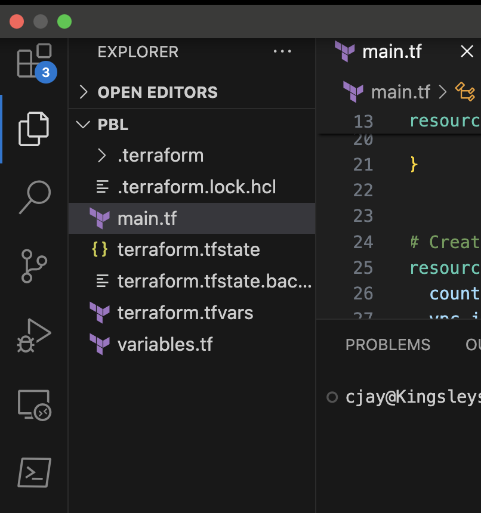

- Run `terraform plan` and ensure everything works!

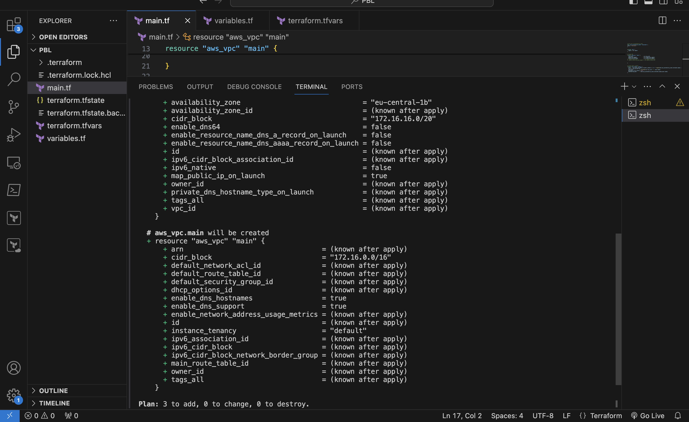

- then `terraform apply`

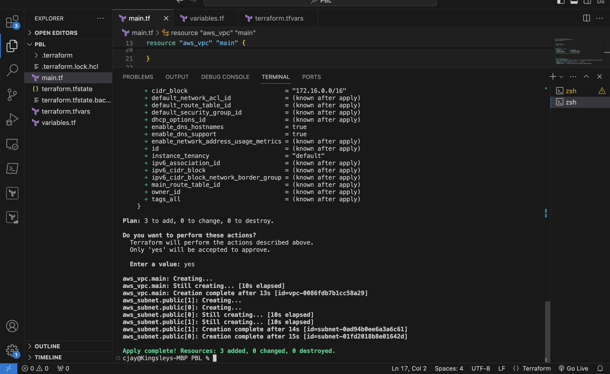
