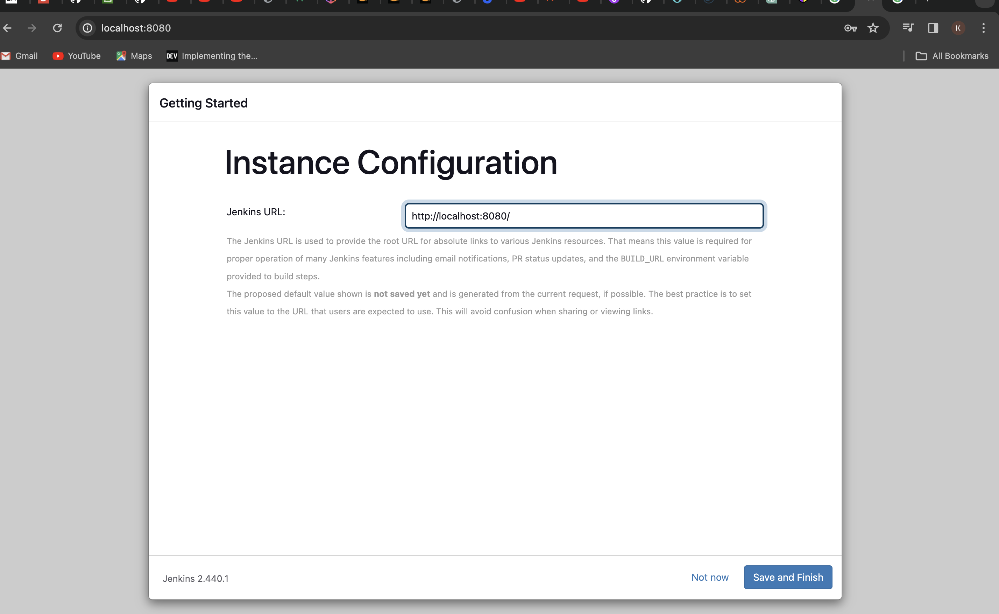
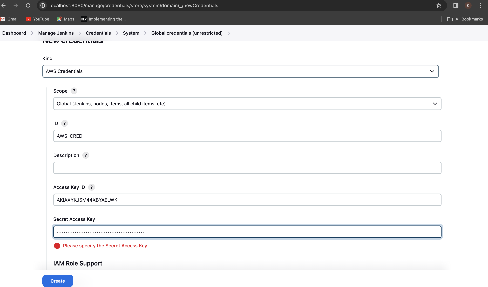
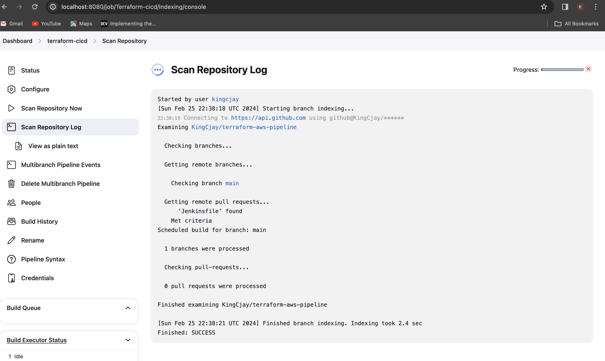

## Implementing CICD Pipeline for terraform using Jenkins

Implementing a seamless CI/CD pipeline for Terraform using Jekins in this project, enabling automated testing,deployment and management of infrastructure-as-code with ease.  

## Introduction to CI/CD and its importance software development

Continuous Integration and Continuous Deployment(CI/CD) have emerged as indispensable practices,fostering automation and agility in the software development lifecycle. In this project,we will explore the powerful combination of Terraform,a leading Infrastructure as Code(IaC)tool,and Jenkins,a widely-used automation server,to streamline and enhance infrastructure deployment workflows.

### Project Overview: 

Here,we will delve into the intricacies of building a robust CI/CD pipeline specifically tailored for Terraform projects. By automating the building,testing and deployment of infrastructure changes,these pipelines enhance speed,reliablity and consistency across enviroments. The use of Infrastructure as Code(IaC) with Terraform ensures reproducibility and scalability while Jenkins facilitates collaborative development,visiblity and continuous integration and deployment as we shall see later. 

### Setting Up the Enviroment

We set up a Jenkins server running in a docker container.

We will create a Dockerfile to define the configuration for our Jenkins server. The Dockerfile will include the necessary dependencies and configurations to run Jenkins seamlessly, and also to run terraform cli.

We write our own dockerfile,and include all configurations;

1. Create a directory and name it `terraform-with-cicd`
2. Create a file and name it `Dockerfile`
3. Add the below content in the `Dockerfile`

Copy Below Code
```php
 # Use the official Jenkins base image
 FROM jenkins/jenkins:lts

 # Switch to the root user to install additional packages
 USER root

 # Install necessary tools and dependencies (e.g., Git, unzip, wget, software-properties-common)
 RUN apt-get update && apt-get install -y \
     git \
     unzip \
     wget \
     software-properties-common \
     && rm -rf /var/lib/apt/lists/*

 # Install Terraform
 RUN apt-get update && apt-get install -y gnupg software-properties-common wget \
     && wget -O- https://apt.releases.hashicorp.com/gpg | gpg --dearmor | tee /usr/share/keyrings/hashicorp-archive-keyring.gpg \
     && gpg --no-default-keyring --keyring /usr/share/keyrings/hashicorp-archive-keyring.gpg --fingerprint \
     && echo "deb [signed-by=/usr/share/keyrings/hashicorp-archive-keyring.gpg] https://apt.releases.hashicorp.com $(lsb_release -cs) main" | tee /etc/apt/sources.list.d/hashicorp.list \
     && apt-get update && apt-get install -y terraform \
     && rm -rf /var/lib/apt/lists/*

 # Set the working directory
 WORKDIR /app

 # Print Terraform version to verify installation
 RUN terraform --version

 # Switch back to the Jenkins user
 USER jenkins

```


1. Install Terraform
   
Copy Below Code
```php
RUN apt-get update && apt-get install -y gnupg software-properties-common wget \
    && wget -O- https://apt.releases.hashicorp.com/gpg | gpg --dearmor | tee /usr/share/keyrings/hashicorp-archive-keyring.gpg \
    && gpg --no-default-keyring --keyring /usr/share/keyrings/hashicorp-archive-keyring.gpg --fingerprint \
    && echo "deb [signed-by=/usr/share/keyrings/hashicorp-archive-keyring.gpg] https://apt.releases.hashicorp.com $(lsb_release -cs) main" | tee /etc/apt/sources.list.d/hashicorp.list \
    && apt-get update && apt-get install -y terraform \
    && rm -rf /var/lib/apt/lists/*

```

**A quick note on GPG Key**: GPG(GNU Privacy Guard) is a free and open-source software for encrypting and signing data. In the context of software distribution,GPG keys are used to verify the integrity and authenticity of packages.

2. Set the working directory

Copy Below Code

`WORKDIR /app`

This line sets the working directory for subsequent commands to `/app`. This is where you'll be when you enter the container.

3. Print Terraform version installation

Copy Below Code 

`RUN terraform --version`

This verifies terraform is installed successfully.

4. Switch back to the Jenkins user

Copy Below Code

`USER jenkins`

This line switches back to the Jenkins user,returning to a lower privilege level. This is a good security practice to minimize the risk of running processes as the root user within the container.

###  Building and running docker image 

The mission now is to have a docker container running Jenkins,but also have terraform installed

Next, we build docker image and run it for further configuration.

Make sure that you are inside the folder containing the `Dockerfile`. This is generally referred to as the `Docker Build Context`. The build context is the set of files located in the specified directory or path when you build a Docker image using the `docker build command`. The content of the build context is sent to the Docker daemon during the build process, and it serves as the source for building the docker image.

1. Build the custom jenkins image 

Copy Below Code 

`docker build -t jenkins-server .`


Notice the "`.`" at the end. 

2. Run the image into a docker container

Copy Below Code

`docker run -d -p 8080:8080 --name jenkins-server jenkins-server`

This should output a hash data like:

Copy Below Code

`5197af728dd8823f474e19f1555af1a9bcab2013b552daa8a0e27ec8be89d234`


3. Check that the container is running: `docker ps`

Copy Below Code

```php
CONTAINER ID   IMAGE            COMMAND                  CREATED              STATUS              PORTS                               NAMES
 5197af728dd8   jenkins-server   "/usr/bin/tini -- /u…"   About a minute ago   Up About a minute   0.0.0.0:8080->8080/tcp, 50000/tcp   jenkins-server
```


4. Access the Jenkins server from the web browser on `localhost:8080`


5. Access the Jenkins Server directly inside the container

Copy Below Code
`docker exec -it  5197af728dd8  /bin/bash`

- Specify the Container ID or Container name(in this case, "`5197af728dd8`")

You'll notice that once you get into the container,the directory you get to find yourself is the `/app`. Which is from the `WORKDIR` directive inside the `Dockerfile`

Copy Below Code

```php
jenkins@5197af728dd8:/app$ pwd
/app
```


6. Retrieve the initial Jenkins admin password

From the web UI,there is an instruction to retrieve the Initial Admin Password from 
`/var/jenkins_home/secrets/initialAdminPassword`

Inside the container,run:

- Retrieve password

Copy Below Code

```php
jenkins@5197af728dd8:/app$ cat /var/jenkins_home/secrets/initialAdminPassword
a845868b3a404f39b48b1b05137b4888
```

7. Installing Jenkins Plugins

- Paste the initial password in the web
- Click on "Install suggested plugins"


8. Create first admin user and access Jenkins





## Setting Up Jenkins for Terraform CI/CD

### Jenkins Pipelines for Terraform

Here, we will experience CI/CD pipeline for Terraform. 

### Set up Git repository with Terraform code

The use case we will satisfy is that
1. Your terraform code has an existing set of resources that it creates in your preferred cloud provider.
2. We as a Devops Engineeer intend to create an additional resource by updating the code base with the new resource that needs to be created.

Therefore, the first logical thing to have is an existing terraform code.

We use the github link below and fork the repository into your own github account `https://github.com/darey-devops/terraform-aws-pipeline.git-` since we don't have our own code. It creates Networking later - it provisions kubernetes cluster using EKS

Then do the following to test that the code can create existing resources;

1. The `provider.tf` file has an S3 backend configuration. You will need to create your own bucket and update the code
- Create an s3 bucket in your AWS account
- Update the bucket bname from the backend configuration
2. Push your latest changes to Github
3. Run terraform init,plan and apply and confirm everything works fine


### Connect the Github repository to Jenkins

1. Install Jenkins Github Plugins:

- Open Jenkins in your web browser(http://localhost:8080).
- Navigateg to "Manage Jenkins"->"Plugins".


- Click on Available plugins


- Scroll down and select the "Github Integration" plugin for installation


- If everything is successful,then click to restart Jenkins


**Note**: You may need to refresh your browser if the restart takes a long time. If this happens,your docker container may exit and Jenkins will no longer load in your browser.

- Go to your terminal and check the status of the container using `docker ps -a` command

Copy Below Code

```php
docker ps -a
CONTAINER ID   IMAGE                  COMMAND                  CREATED        STATUS                     PORTS                       NAMES
800f8f48466b   jenkins-server         "/usr/bin/tini -- /u…"   7 days ago     Exited (5) 8 minutes ago                               jenkins-server
```


- Take the container ID and simply restart it

Copy Below Code

`docker restart 5197af728dd8`

- Check the status of the container again and it should be back up.
- Then go back to the browser and access Jenkins.
- Back in Jenkins UI,navigate to the "Installed plugins"section and you should now see the newly installed plugin and it is enabled


This plugin basically connects Jenkins,with GitHub. It allows  Jenkins to automatically perform tasks like building and testing code whenever changes are made in a GitHub repository.

Next we configure github credentials in Jenkins so that Jenkins can authenticate to the repository.

### Install more plugins

To ensure a seamless and efficient pipline within Jenkins,it is recommended to install additional essential plugins: the Terraform and the AWS Credential plugin.

- Terraform Plugin:


The Terraform plugin for Jenkins enables seamless integration of Terraform into Jenkins.
- AWS Credential Plugin:


This plugin is essential for securely managing and utilizing AWS(Amazon Web Services)credentials within Jenkins. It also facilitates the secure storage and retrieval of AWS access and secret keys,ensuring that Jenkins jobs and pipelines can securely interact with AWS services during the execution of various tasks and deployments, including terraform runs.

### Configure GitHub Credentials in Jenkins:

We need to store the github credentials in Jenkins. This way, Jenkins connects to Github.

Copy Below Code

`- In Github, navigate to your profile -> Click on "Settings" -> then scroll down to -> "Developer Settings"`


- Generate an access token


- Copy the access token and save in a notepad for use later

- In Jenkins,navigate to "Managee Jenkins"-> Click on "Credentials"


- Click on the arrow next to "global" and select "Add credentials"


- Select username and password. Use the Access token generated earlier as your password,and specify anything descriptive as your ID


- In the Credentials section, you will be able to see the created credential


- Create a second credential for AWS secret and access key. If you have installed the AWS credentials plugin,you will see the AWS Credentials" Kind as shown below. Simpl add the AWS secret and access ke generated from AWS console.

After you must have installed AWS plugins;




1. Set up a Jenkins Multibranch Pipeline:

- From the Jenkins dashboard,click on "New Item"


- Give it a name and description


- Select the types of source of the code and the Jenkinsfile


- Select the credentials to be used to connect to Github from Jenkins


- Add the repository URL. Ensure you have forked it from `https://github.com/darey-devops/terraform-aws-pipline.git/`


- Leave everything at default and hit save


- You will immediately see the scanning of the repository for branches, and the Jenkinsfile



- The terraform-cicd pipeline and main branch scanned 


- Pipeline run and Console output


- Click on "Build now" for a second run and check the console output


- Show the plan and decide to proceed to apply or abort


### Tasks 

#### Enhance and Extend the Pipeline 

#### Objective:

Update the existing pipeline script to include additional stages and improve the existing ones. This will encompass adding new functionally,improving code clarity and ensuring best practices in CI/CD pipelines.

1. Create a new branch from the main branch and scan the Jenkins pipeline so that the new branch can be discovered.
2. In the new branch,Correct and Enhance the "Terraform Apply"Stage The current **'Terraform Apply'** stage mistakenly contains a `sh 'terraform apply -out=tfplan` command. Correct this to `sh 'terraform apply tfplan'`.
3. Add logging to track the progress of the pipeline within both Terraform plan & apply. Use the `echo`  command to print messages before and after each execution so that in the console output everyone can understand what is happening at each stage.
4. Introduce a new stage in the pipeline script to validate the Terraform configurations using terraform validate command. Add the 'Lint Code'Stage,Place this stage before the 'Terraform Plan'stage. The purpose of this stage is to validate the syntax,consistency and correctness of Terraform configuration files in the directory it is run. It does not access any remote services.
5. Introduce a 'Cleanup' Stage

Add a final stage named 'Cleanup' that runs regardless of whether previous stages succeeded or failed(use the post directive). In this stage,include commands to clean up any temporary files or state that the pipeline may have created. 

6. Implement Error Handling

Add error handling to the pipeline. For instance,if 'Terraform Apply'fails,the pipeline should handle this gracefully,perhaps by sending a notification or logging detailed error messages.

7. Document the Pipeline

Add comments to the pipeline script explaining each stage and important commands. This will make the pipeline more maintainable and understandable.
   


