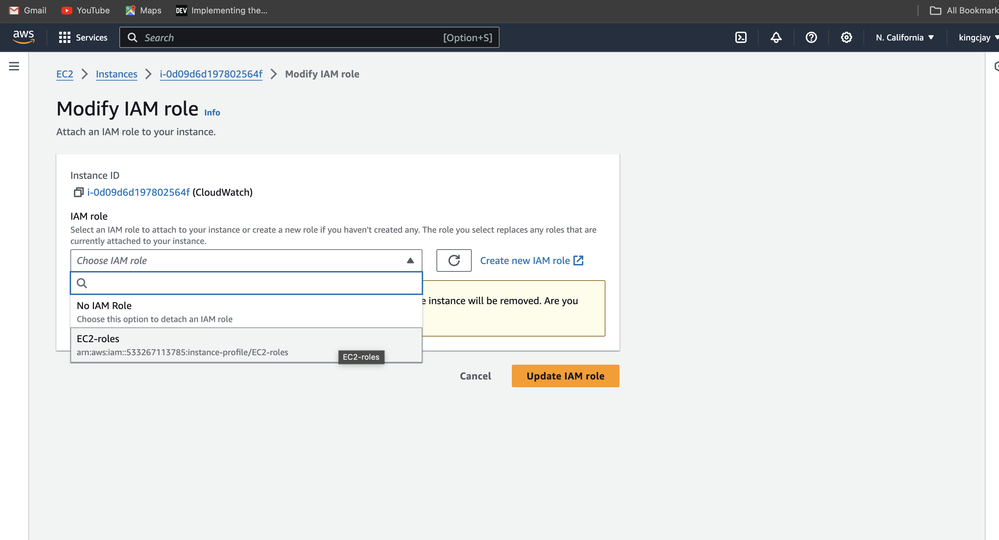

## Monitoring Infrastructure in AWS (Cloudwatch, Cloudtrail)

### Introduction to Monitoring Infrastructure in AWS

As your uasage and applications rows in AWS, s does the complexity of managing its underlying infrastructure. How do you ensure everything continues to run smoothly? How do you detect and address issues before they impact your users? This is where monitoring your infrastructure becomes crucial.

Monitoring refers ro the process of observing and collecting data about the performance, health and behaviour of systems, applications, networks, or infrastructure components. The primary goal of monitoring is to ensure that these systems operate effectively, efficiently and securely while also detecting and addressing any issues or anomalies in a timely manner.


### AWS CloudWatch and CloudTrail

AWS CloudWatch is a monitoring and observability service provided by Amazon Web Service(AWS). It allows users to collect and track metrics, monitor logs, set alarms and automatically react to changes in AWS resources and applications running on the AWS infrastructure. CloudWatch provides insights into the performance, health and operational status of AWS resource and applications, helping users to troubleshoot issues, optimize resource utilization and ensure the reliablity of their system. 

AWS CloudTrail on the other habd is also a service provided by AWS that enables governance, compliance, operational auditing and risk auditing of your AWS account. CloudTrail records and logs all API activity in your AWS account, providing a comprehensive trail of events that can be used for security analysis, resource change tracking, troubleshooting and compliance auditing.

### CloudWAtch Metrics and Alarms

Amazon CloudWatch Metrics and Alarms are essential components of Amazon CloudWatch service, which provides monitoring and observabilty capabilities for AWS resources and applications.

#### CLoudWatch Metrics 

These are data points representing the behavior of AWS resources and applications over time. These metrics can be collected from various AWS services such as Amazon EC2, Amazon RDS, Amazon S3, AWS Lambda, and many others. Metrics provide insights into the performance, health and operational ststus of these resources, allowing users to monitor and analyze their behavior.


Key aspects of CloudWatch Metrics include:

- Default and Custom Metrics: AWS services automatically publish default metrics to CloudWatch, such as CPU utilization, network traffic and disk I/O for EC2 instances. Additionally, users can create custom metrics to monitor specific aspects of their applications or services.

- Namespace and Dimensions: Matrics are organized into namespaces, which categorize related metrics together. Within each namespace, metrics can have dimensions that further specify the resource or aspect being monitored. For example, an EC2 instance metric might have dimensions such as instanceID or InstanceType.

- Timestamps and Units: Each metric data point includes a timestamp indicating when the measurement was taken, as well as a unit specifying the measurement's scale(e.g., bytes,percentage,seconds).


- Retention and Granularity: CloudWatch retains metric data for differnt periods depending on the data's age and granularity. Users can specify the granularity of their metric data, ranging from one-minute to one-day intervals.


#### CloudWatch Alarms

CloudWatch Alarms allow users to define thresholds on CloudWatch Metrics and trigger actions when these thresholds are breached. Alarms are used to proactively monitor the health performance of AWS resources and applications, enabling users to respond promptly to changes in their enviroment.

Key aspects of CloudWatch Alarms include:

- Thresholds and Actions: Users can set thresholds on CloudWatch Metrics, specifying conditions that, when met or exceeded, trigger alarm states. When an alarm enters an alarm state, users can configure actions such as sending notifications via Amazon SNS, executing AWS Lambda functions, or autoscaling resources.

- Alarm States: CloudWatch Alarm have three possible states; OK, INSUFFICIENT_DATA and ALARM. The OK state indicates that the metric is within the defined threshold, while the ALARM state indicates that the threshold has been breached. The INSUFFICIENT_DATA state occurs when there is not enough data to evaluate the alarm. 

- Alarm History: CloudWatch maintains a history of alarm state changes, allowing users to track when alarms transition between states and investigate the circumstances surrounding each state change.

- Configuration and Management: Users can create, modify and delete alarms through the CloudWatch Management Console,AWS CLI or SDKs. Alarms can be managed individually or part of larger monitoring configurations, such as CloudFormation templates or AWS Auto Scaling policies.

### Monitoring AWS EC2 using CloudWatch

Here, we launch an EC2 instance and use AWS CloudWatch and CloudTrail to monitor it.

#### Step 1: Create an IAM Role With CloudWatchFull Access and SSMFullAccess

1. Navigate to the IAM console.
2. In the IAM Console navigation click on roles.


3. Follow the image to create a role with `CloudWatchFullAccess` and `SSMFullAccess` policy.


#### Step 2: Create A Parameter in System Manager

Now that we have created an IAM role, we need to create a parameter in the system manager console. By doing this, we will be able to define the metrics we want to monitor for our EC2 instance

1. navigate to the AWS System Manager Console.
2. In the AWS Syetem Manager navigate menu, selecte parameter store


3. Create a new parameter and paste the code snippet below

Copy Below Code

```php
{
	"metrics": {
		"append_dimensions": {
			"InstanceId": "${aws:InstanceId}"
		},
		"metrics_collected": {
			"mem": {
				"measurement": [
					"mem_used_percent"
				],
				"metrics_collection_interval": 180
			},
            "disk": {
				"measurement": [
                     "disk_used_percent"
				],
				"metrics_collection_interval": 180
			}
		}
	}
}
```


The parameters `metrics, append_dimensions, metrics_collected` above are a configuration file for the CloudWatch agent, which defines the metrics that will be collected from your EC2 instance and sent to CloudWatch.

#### Step 3: Create EC2 Instance, Attach the role created in Step 1

Now that we have created an IAM Role and also created a parameter in the Account System Manager Console, let's create an EC2 instance and in that roles we created earlier. But note that `SSM` will have access to the parameter we created and by attaching the role to the EC2 instance, EC2 will also have access to the parameters

1. Navigate to the EC2 console, select instances. Click on launch instance on the top right
2. Now we will need to launch an `Amazon Linux 2 instance` and attach the role we created in `step 1`. 

Follow the images below to attach IAM role to your instance





3. Install CloudWatch agent. Create a file name `script.sh` and paste the shell script below

- Create a file 

Copy Below Code
`sudo nano script.sh`

Copy Below Code

```php
#!/bin/bash
wget https://s3.amazonaws.com/amazoncloudwatch-agent/linux/amd64/latest/AmazonCloudWatchAgent.zip
unzip AmazonCloudWatchAgent.zip
sudo ./install.sh
sudo /opt/aws/amazon-cloudwatch-agent/bin/amazon-cloudwatch-agent-ctl -a fetch-config -m ec2 -c ssm:/alarm/AWS-CWAgentLinConfig -s


```

- Make the file executable

Copy Below Code

`sudo chmod +x script.sh`

- Save and run the file

Copy Below Code 

`./script.sh`


4. Start the CloudWatch agent

Copy Below Code
```php
 sudo /opt/aws/amazon-cloudwatch-agent/bin/amazon-cloudwatch-agent-ctl -m ec2 -a start

```


5. Verify if CloudWatch is installed and successfully running

Copy Below Code 

```php
 sudo /opt/aws/amazon-cloudwatch-agent/bin/amazon-cloudwatch-agent-ctl -m ec2 -a status
```


#### Step 4: Monitor Your Metric In CloudWatch

Before we can monitor our EC2 instance metrics, create a new policy and attach it to our IAM role so that the role does not lack permissions to perform the ec2:DescribeTags action, which is necessary for the CloudWatch agent to retrieve EC2 instance tags.

1. Create a new Policy 

- In the IAM console navigation menu, click on policy and on the top right, select create policy. Follow the image below to create a new policy for the IAM role. Use the Json code snippet below for your policy

Copy Below Code 

```php
{
    "Version": "2012-10-17",
    "Statement": [
        {
            "Effect": "Allow",
            "Action": [
                "ec2:DescribeTags"
            ],
            "Resource": "*"
        }
    ]
}

```

- Create a policy i.e Ec2Tag Policy
- Attach the policy to the Role


- Paste yourr script and next


2. Let's recall the parameters we created for our EC2 metric, now let's view the metric on CloudWatch console.

- Navigate to the CloudWatch console. In the navigation menu, select all metrics 


- Select the browser tab and search, click on CWAgent


- Select either of the two as highlighted in the image below to view any of the metric we defined in our parameter


- We can view our metric the momory percent of our EC2 instance


