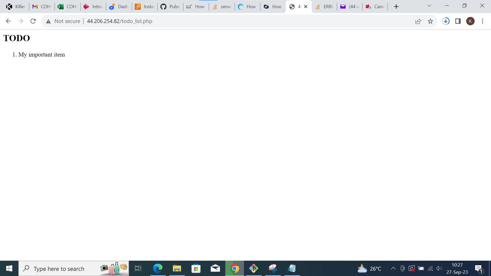

# WEB STACK IMPLEMENTATION LEMP STACK (Linux,NGINX,MySQL and PHP) 

## Prerequistes 

- Cloud Service Providers; AWS,Azure,GCP,etc.
- Launch a Linux instance on ubuntu(prefarbly).
- Priot knowledge on how to SSH into virtual host.

## STEP 1: INSTALLING NGINX WEB SERVER
It's always the best practice and a first step to update your server before any other exercise or working on your web server. To update your server, run the following command;

`sudo apt update`


To install Nginx, run the command below;

`sudo apt install nginx -y` (y for the prompt Yes?No question to install)

And run the command `nginx -v` to see the version of your nginx:


To verify that nginx is installed and running;

`sudo systemctl status nginx`


If it is actively enabled and running, test on your web browser with this url 
http://Public-IP-Address:80

## STEP 2-INSTALLING MYSQL

Using the apt command, we install our database(MySQL)

`sudo apt install mysql-server -y`

When istallation is finished, login into MySQL console with the command;

`sudo mysql`

Define the users password using this command 

`ALTER USER 'root'@'localhost' IDENTIFIED WITH mysql_native_password BY 'PassWord';`

Exit MySQL shell with:

`mysql> exit`

Start the interactive script by running:

`sudo mysql_secure_installation`


VALIDATE PASSWORD PLUGIN, you can configure if you want.

## STEP 3-INSTALLING PHP

You'll need to install `php-fpm`, which stands for "PHP fastCGI process manager",and tell Nginx to pass PHP requests to this software for processing. Also you'll add `php-mysql`,a PHP module that allows PHP to communicate with MYSQL-based databases. Core PHP packages will automatically be installed as dependences.

To install these 2 packages at once, run:

`sudo apt install php-fpm php-mysql -y`


## STEP 4-CONFIGURE NGINX TO USE PHP PROCESSOR

When using the Nginx web server, we can create server blocks (similar to virtual hosts in Apache) to encapsulate configuration details and host more than one domain on a single server.

Creat the root web directory for your domain as follows:

`sudo mkdir /var/www/LEMPproject`

Next, assign ownership of the directory with the $USER environment variable, which will reference your current system user:

`sudo chown -R $USER:$USER /var/www/LEMPproject`


Create a new configuration file in Nginx’s sites-available directory

`sudo nano /etc/nginx/sites-available/LEMPproject`

Paste in the followin bare-bones configuration:

```php 
server {
	listen 80;
	server_name LEMPproject www.LEMPproject;
	root /var/www/LEMPproject;
 
	index index.html index.htm index.php;
 
	location / {
    	try_files $uri $uri/ =404;
	}
 
	location ~ \.php$ {
    	include snippets/fastcgi-php.conf;
    	fastcgi_pass unix:/var/run/php/php8.1-fpm.sock;
 	}
 
	location ~ /\.ht {
    	deny all;
	}
 
}

```

`cat /etc/nginx/sites-available/LEMPproject`


Activate your configuration by linking to the config file from Nginx’s sites-enabled directory:

`sudo ln -s /etc/nginx/sites-available/LEMPproject /etc/nginx/sites-enabled/`
Test your configuartin for syntax error by typing;

`sudo nginx -t`

If you get the successful message below, you're on track.


Reload Nginx to apply changes;

`sudo systemctl reload nginx`

## STEP 5-TESTING PHP WITH NGINX

You can test to validate that Nginx can hand .php files off to PHP processor.

You can do this by creating a test PHP file in your document root. Open a new file called info.php within your document root in your text editor:

`sudo nano /var/www/LEMPproject/info.php`

```php
<?php
phpinfo();
```

Copy and paste the above text into the info.php file

You can now access this page in your web browser by visiting the domain name or public IP address you’ve set up in your Nginx configuration file, followed by /info.php:
http://PublicIPAddress/info.php

You will see a web page containing detailed information about your server:


After checking the relevant information about your PHP server through that page, it’s best to remove the file you created as it contains sensitive information about your PHP environment and your Ubuntu server. You can use rm to remove that file:

`sudo rm /var/www/your_domain/info.php`

# STEP 6 - RETRIEVING DATA FROM MYSQL DATABASE WITH PHP

We'll need to create a new user with the `mysql_native_password authentication` method in order to be able to connect to the MySQL database from PHP.

Create a database kingcjay_database and a user kingcjay_user.

First connect the MySQL console using the root account;

`sudo mysql`

To create a new database, run the following command from your MySQL console:
`mysql> CREATE DATABASE` kingcjay_database; Now you can create a new user and grant him full privileges on the database you have just created.

`mysql> CREATE USER 'kingcjay_user'@'%' IDENTIFIED WITH mysql_native_password BY 'PassWord.1';` NB: REPLACE 'passWord.1' with your preferred 'string'

Now we need to give this user permission over the kingcjay_database database:

`mysql> GRANT ALL ON kingcjay_database.* TO 'kingcjay_user'@'%';`

Now exit the MySQL shell with:

`mysql> exit`


You can test if the new user has the proper permissions by logging in to the MySQL console again, this time using the custom user credentials:

`mysql -u kingcjay_user -p`

`mysql> SHOW DATABASES;`


Next, we’ll create a test table named todo_list. From the MySQL console, run the following statement:

```
CREATE TABLE kingcjay_database.todo_list (
mysql> 	item_id int NOT NULL AUTO_INCREMENT,
mysql> 	content varchar(255),
mysql> 	PRIMARY KEY(item_id)
mysql> );
```


Insert a few rows of content in the test table. You might want to repeat the next command a few times, using different VALUES:

`mysql> INSERT INTO kingcjay_database.todo_list (content) VALUES ("My important item");`

To confirm that the data was successfully saved to your table, run:

`mysql> SELECT * FROM kingcjay_database.todo_list;`

You'll see the below output;  

After confirming your test table, run the command to exit MySQL;

`mysql> exit`


Now you can create a PHP script that will connect to MySQL and query for your content. Create a new PHP file in your custom web root directory

`sudo nano /var/www/LEMPproject/todo_list.php`

The following PHP script connects to the MySQL database and queries for the content of the todo_list table, displays the results in a list. If there is a problem with the database connection, it will throw an exception.

Copy this content into your todo_list.php script:
```php
<?php
$user = "kingcjay_user";
$password = "password";
$database = "kingcjay_database";
$table = "todo_list";
 
try {
  $db = new PDO("mysql:host=localhost;dbname=$database", $user, $password);
  echo "<h2>TODO</h2><ol>";
  foreach($db->query("SELECT content FROM $table") as $row) {
	echo "<li>" . $row['content'] . "</li>";
  }
  echo "</ol>";
} catch (PDOException $e) {
	print "Error!: " . $e->getMessage() . "<br/>";
	die();
}
```

Save and close the file when you're done editing


You can now access this page in your web browser by visiting the domain name or public IP address configured for your website, followed by /todo_list.php:
http://Public_domain_or_IP/todo_list.php




