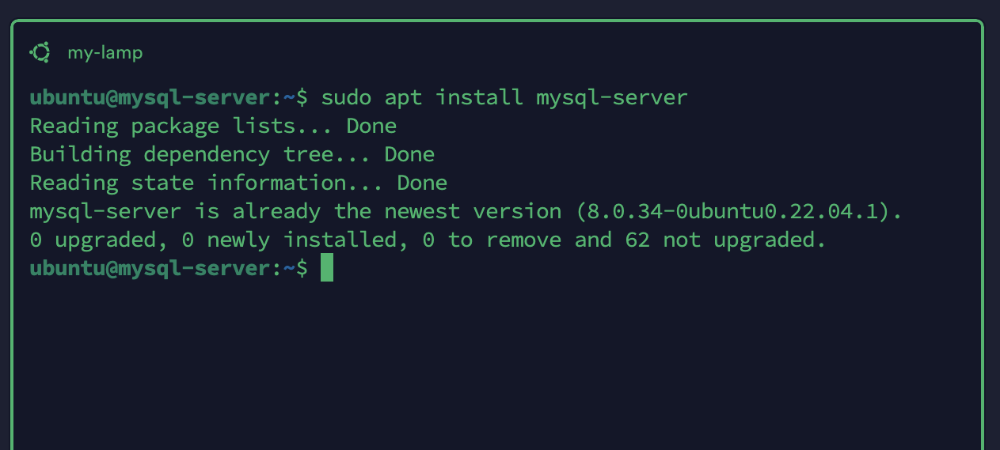
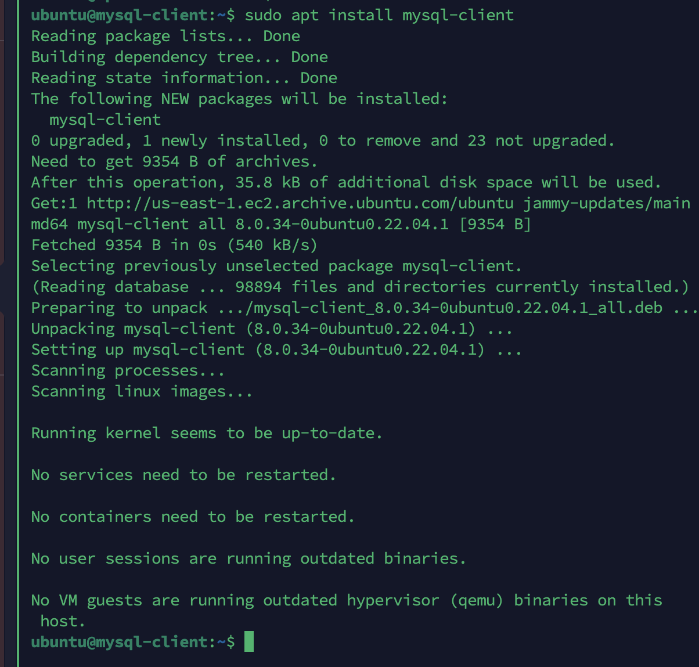
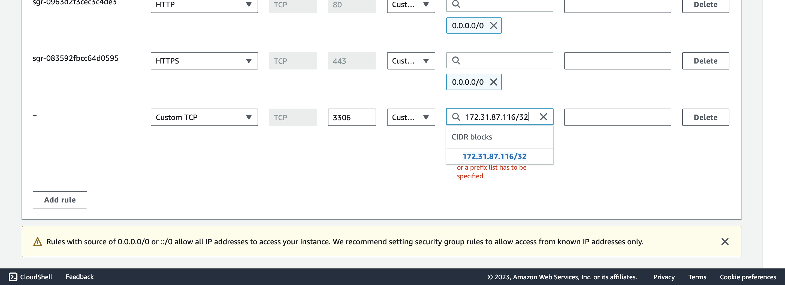
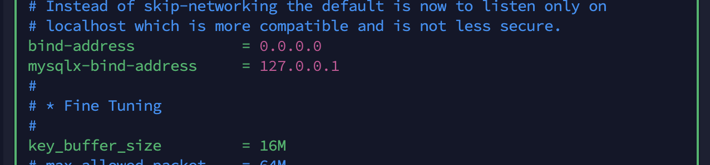
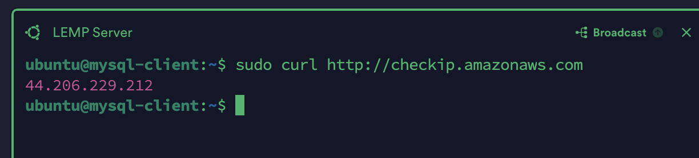
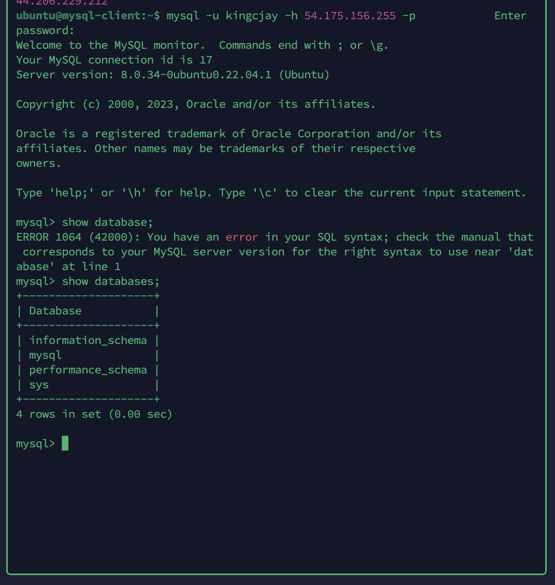

# Implement a Client Server Architecture using MySQL Database Management System(DBMS)

TASK - Implement a Client Server Architecture using MySQL Database Management System(DBMS)

To demonstrate a basic client-server using MySQL RDBMS, we follow the below instructions 

1. Create and configure two Linux-based virtual servers(EC2 instances in AWS)

Server A name - `mysql-server`
Server B name - `mysql-client`

`sudo hostname mysql-server` & `sudo hostname mysql-client` then `bash`

2. On `mysql-server` Linux Server install MySQL Server software

`sudo apt install mysql-server`

3. On `mysql-client` Linux Server install MySQL Client software.

`sudo apt install mysql-client`

4. By default, both of your EC2 virtual servers are located in the same local virtual network, so they can communicate to each other using local IP addresses. Use **mysql-server's** local IP address to connect from **mysql-client**. MySQL server uses TCP port 3306 by default, so you will have to open it by creating a new entry in ‘Inbound rules’ in ‘mysql-server’ Security Groups. For extra security, do not allow all IP addresses to reach your ‘mysql-server’ – allow access only to the specific local IP address of your ‘mysql-client’.

Results:

5. We configure **mysql-server** to allow connections from remote hosts.

`sudo nano /etc/mysql/mysql.conf.d/mysqld.cnf`

Replace the following line;

`bind-address = 127.0.0.1`

with the following:

`bind-address = 0.0.0.0`

6. On mysql-server we create  a user 'kingcjay' in MySQL to link with mysql-client. 

Run the command:

`sudo mysql -u root -p`

In your mysql-server ec2 instance allow the ipaddress of the mysql-client ec2 instance with port 3306 to access the mysql-server ec2 instance.

Run the command on the client server to get the public ip:

`sudo curl https://checkip.amazonaws.com`

Create a user in MySQL with the command:

`mysql> CREATE USER 'kingcjay'@'44.206.229.212' IDENTIFIED BY 'passworrdC00l';`

`mysql> GRANT ALL PRIVILEGES ON * . * TO 'kingcjay'@'44.206.229.212';`

7. To connect to the **mysql-server**, in your **mysql-client** enter the following code.

`mysql -u kingcjay -h 54.175.156.255 -p`

Note: The format is 

mysql -u <user> -h <ipaddress-of-the-server> -p (the server here is the mysql-server)

show database:

