# Implementing LoadBalancers With Nginx

## Introduction to Load Balancing and Nginx

Load balancing spreads incoming network traffic across a group of backend servers to ensure satisfactory speed and optimized functioning. The group of backend servers is commonly called a server farm or server pool. This is done so that no one computer gets overloaded with too much work

Nginx is a versatile software, it can act as a webserver, reverse proxy and a load balancer etc. All that is needed is to configure it properly to server your use case.

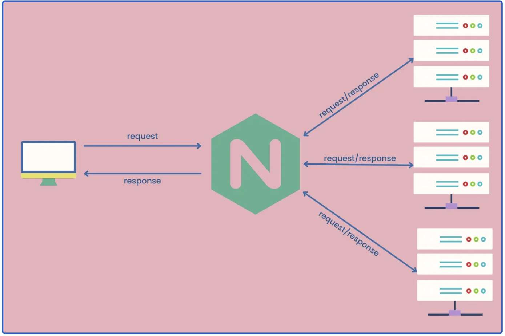

## Setting Up a Basic Load Balancer

We are going to be provisioning two two EC2 instances running ubuntu and install apache webserver in them. We will open port 8000 to allow traffic from anywhere, and finally update default page of the webservers to display their public IP addresses.

Next we will provision another EC2 instance running ubuntu 22.04.3 and install Nginx. We will now configure it to act as a load balancer distributing traffic across the webservers.

**Step 1**: Provisioning EC2 instances 

### Prerequisites

- Cloud Service Provider - AWS, Azure, GCP, etc.
- Launch a Linux Instance (Ubuntu preferably).
- Priot knowledge on how to SSH into a virtual host.

A prompt on instances, launch two instances providing a unique name for each of the webservers. 

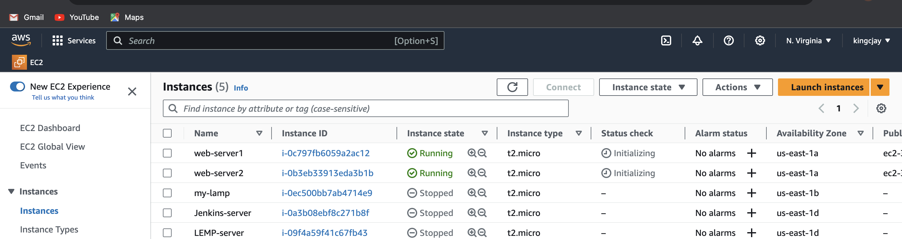

**Step 2**: Open port 8000 We will be running our webservers on port 8000 while load balancer runs on port 80. We need to open port 8000 to allow traffic from anywhere. To do this wee need to add rule to the security groups of each of our webservers.

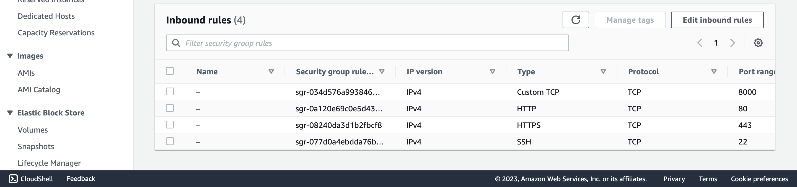

**Step 3**: Install Apache Webserver

After provisioning both servers and have opened the necessary ports, we now install apache software on both servers. We connect both servers through ssh and run commands on the terminal of our webservers.

Copy the ssh command Example:

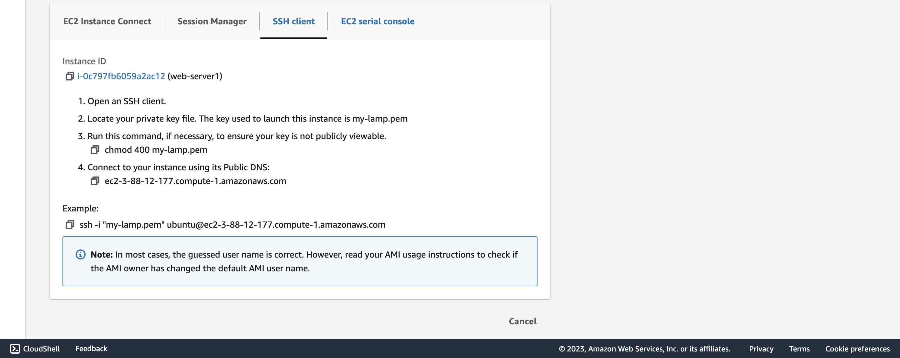

Open a terminal on your loacl machine, cd into the folder where the keypair of your webserver is located and paste the ssh command. The folder in this case is Downloads 

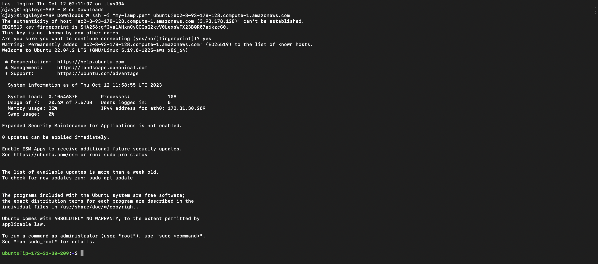

- Next install apache with the command below 

`sudo apt update`

`sudo apt install apache2 -y`

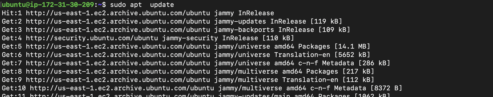

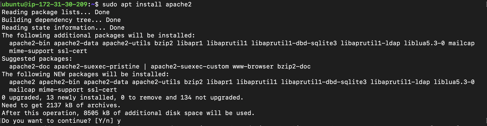

Verify that apache is running 

`sudo systemctl status apache2`

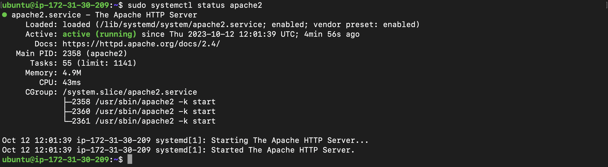

**Step 4**: Configure Apache to server a page showing its public IP address:

We will start by configuring Apache webserver to serve content on port 8000 instead of its default port 80. Then we will create a new **index.html**
file. The file will contain code to display the public IP of the EC2 instance. We will then override apache webserver's default html file with our new file. 

- Configure Apache to serve content on port 8000:

1. Using the text editor nano open file /etc/apache2/ports.conf/

`sudo vi /etc/apache2/ports.conf` 

2. Add a new listen directive for port 8000:

`cat /etc/apache2/ports.conf/`

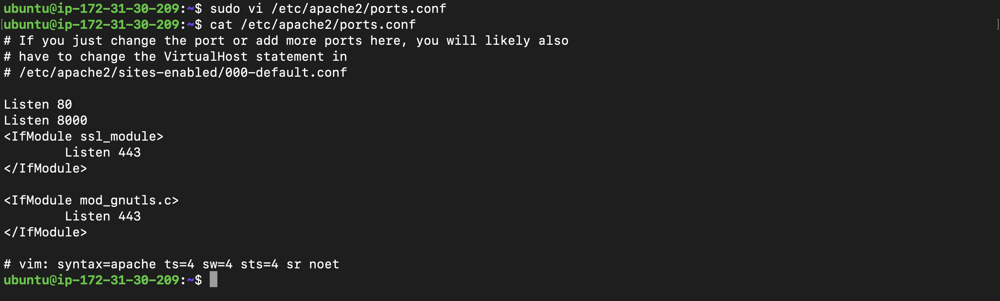

3. Open the file /etc/apache2/sites-available/000-default.conf and change port 80 on the virtualhost to 8000:

`sudo vi /etc/apache2/sites-availabe/000-default.conf`

`cat /etc/apache2/sites-availabe/000-default.conf`

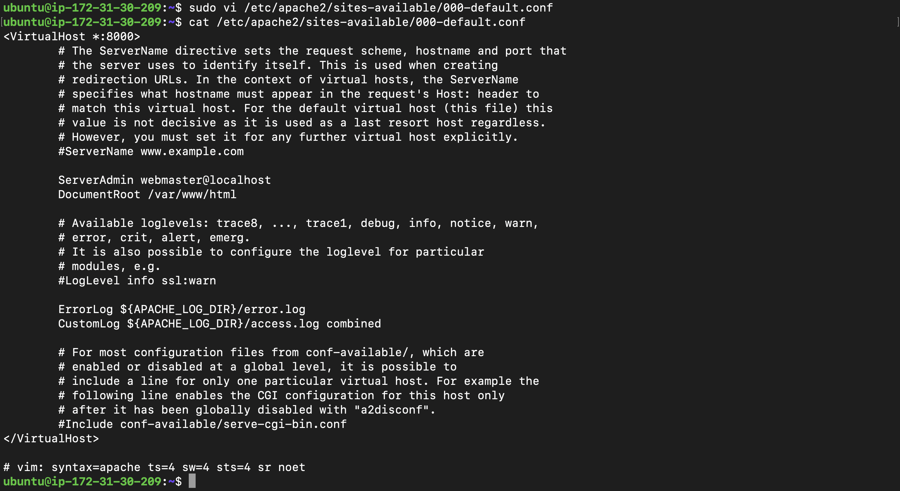

4. Restart apache to load the new configuration:

`sudo systemctl restart apache2`


- Creating a new html file:

1. Open index.html file 

`sudo vi index.html`

2. Get the public IP of the instances on the EC2 instances on AWS console and the placeholder text for IP address.
```php
        <!DOCTYPE html>
        <html>
        <head>
            <title>My EC2 Instance</title>
        </head>
        <body>
            <h1>Welcome to my EC2 instance</h1>
            <p>Public IP: YOUR_PUBLIC_IP</p>
        </body>
        </html>
```

`cat index.html`

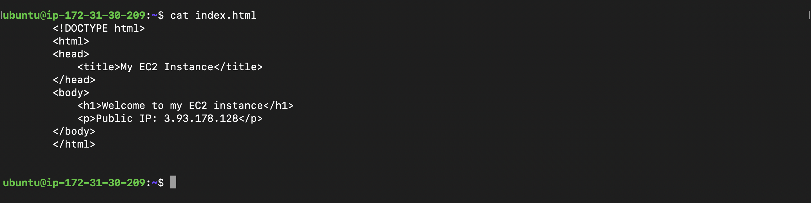

3. Change file ownership of the index.html file with the command below:

`sudo chown www-data:www-data ./index.html`


- Overriding the default html file of Apache Webserver:

1. Replace the default html file with our new html file with the command:

`sudo cp -f ./index.html /var/www/html/index.html`


2. Restart webserver to load the new configuration with the command below:

`sudo systemctl restart apache2`


We have the pages of our two Apache servers below 

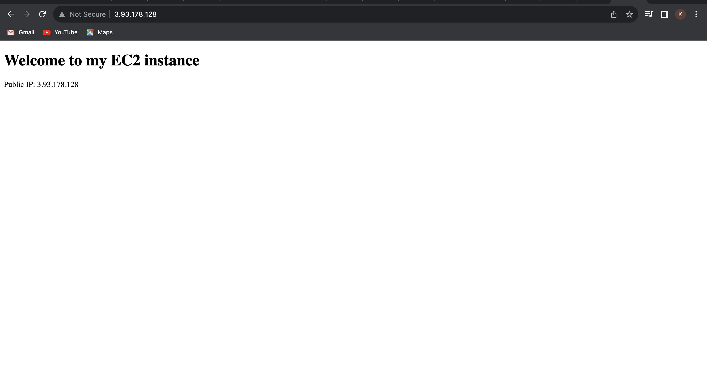

**Step 5**: Configuring Nginx as a load balancer

- Provision a new EC2 instance running ubuntu 22.04.3. We open port 80 and accept traffic from anywhere like step 1 and 2 above.

- SSH in to the instance like step 3.

- Install nginx 

`sudo apt update`

`sudo apt install nginx -y`

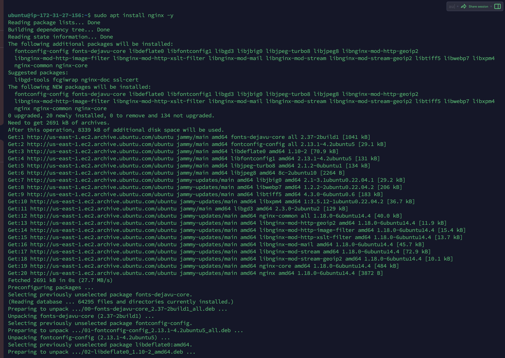

- Verify that nginx is installed with the command:

`sudo systemctl status nginx`

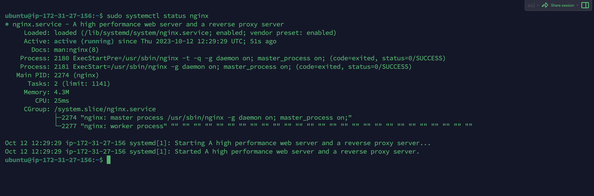

- Open nginx configuration file by running:

`sudo vi /etc/nginx/conf.d/loadbalancer.conf`

- Paste and edit the configuration file below making sure we provide the necessary information like the server IP address;

```php
        
        upstream backend_servers {

            # your are to replace the public IP and Port to that of your webservers
            server 127.0.0.1:8000; # public IP and port for webserser 1
            server 127.0.0.1:8000; # public IP and port for webserver 2

        }

        server {
            listen 80;
            server_name <your load balancer's public IP addres>; # provide your load balancers public IP address

            location / {
                proxy_pass http://backend_servers;
                proxy_set_header Host $host;
                proxy_set_header X-Real-IP $remote_addr;
                proxy_set_header X-Forwarded-For $proxy_add_x_forwarded_for;
            }
        }
```

`cat /etc/nginx/conf.d/loadbalancer.conf`

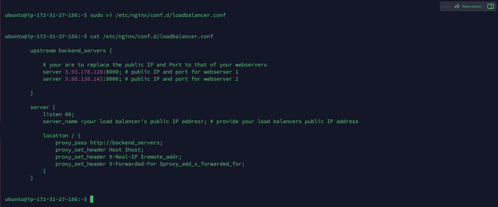

- Test your configuration file withe the command:

`sudo nginx -t`

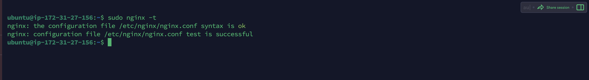

- If there are no errors, restart Nginx to load the new configuration with the command below:

`sudo systemctl restart nginx`

- Paste the public IP of the Nginx loadbalancer, you should see the same pages served by the webservers titling on the loadbalancer.

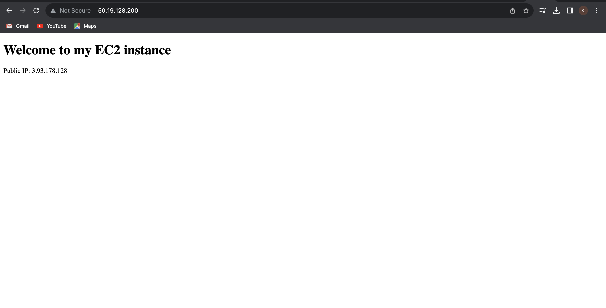

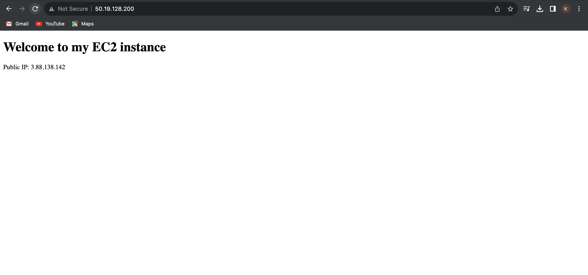