# Ansible-Automate Project

## Ansible Configuration Management - Automate Project 7 to 10

Ansible is a configuration management platform that automates storage, servers, and networking. When you use Ansible to configure these components, difficult manual tasks become repeatable and less vulnerable to error.


## Ansible Client as a Jump Server(Bastion Host)

A **Jump Server**(sometimes referred as **Bastion Host**) is an intermediary server through which access to internal network can be provided. With the current architecture of our work, the webservers would be inside a secured network which cannot be reached directly from the internet. This means that even DevOps engineers cannot `SSH` into the webservers directly and can only access it through a Jump Server - it provides better security and reduces ***attack surface***.

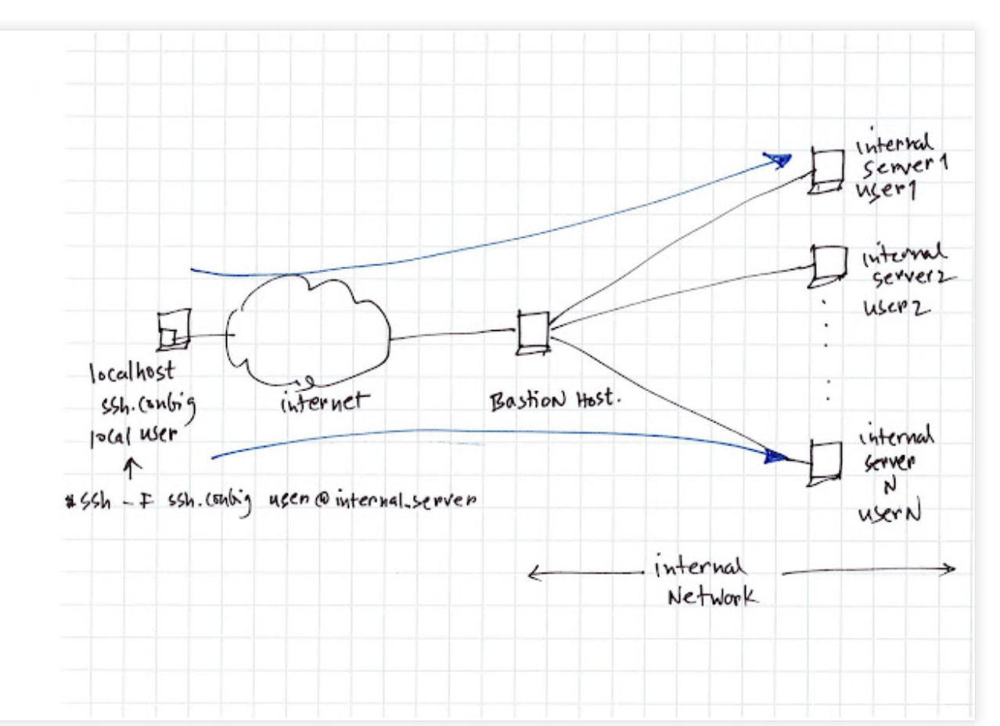

**Task**

- Install and configure Ansible client to act as a Jump Server/Bastion Host
- Create a simple Ansible playbook to automate servers configuration

**Install and configure ansible on ec2 instance**

**Step 1**- **Install and Configure Ansible on EC2 Instance

1. Update the `Name` tag on your `Jenkins` EC2 Instance to `Jenkins Ansible`. We wwill use the server to run playbooks.
2. In your GitHub account create a new repository and name it `ansible-config-mgt`.
3. Install **Ansible**.

`sudo apt update`

`sudo apt install ansible`

Check ansible version by running `ansible --version`

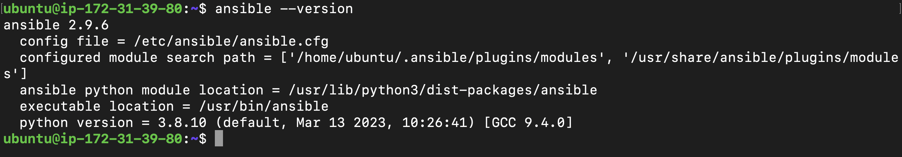

4. Configure Jenlins build jobs to archive your repository content every time you change it. 

- Create a new Freestyle project `ansible` in Jenkins and point it to your 'ansible-config-mgt' repository.
- Configure a webhook in GitHub and set the webhook to trigger `ansible` build.
- Configure a Post-build job to save all (**)files.

5. Test your setup by making some change in README.md file in `master` branch and make sure that build starts automatically and Jenkins saves the files(build artifacts) in the following folder

`ls /var/lib/jenkins/jobs/ansible/builds/<build_number>/archive/`

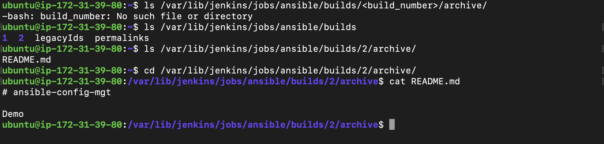

**Note**: Trigger Jenkins project execution only for main(or master) branch.


**Tip**: Every time you stop/start your `Jenkins-Ansible` server, you habe to configure GitHub webhook to a new IP address in order to avoid it, it makes sense to allocate an **Elastic IP** to your `Jenkins-Ansible` server. Note the Elastic IP is free only when it is being allocated to an EC2 Instance, so do not forget to release Elastic IP once you terminate your EC2 Instance.

**Step 2 - Prepare your development enviroment using Visual Studio Code**

1. Using our ***Integrated development enviroment(IDE)*** or ***Source-Code Editor*** in this case VSCode.
2. After installing VSC, configure it and connect our newly created GitHub repository 
3. Clone down your ansible-config-mgt repo to your Jenkins-Ansible instance

`git clone <ansible-config-mgt repo link>`

**Begin ansible development**

**Step 3 - Begin Ansible Development**

1. In your ansible-config-mgt GitHub repository, create a new branch that will be used for development of a new feature.
**Tip:** Give your branches descriptive and comprehensive names with a topic for brief description what the branch is about (e.g. `feature/prj-11`).
2. Checkout the newly created feature branch to your local machine and start building your code and directory structure.
3. Create a directory and name it `playbooks`- it will be used to store all playbook files.
4. Create a directory and name it `inventory`- it will be used to keep your hosts organised.
5. Within the ***playbooks*** folder, create your first playbook, and name it `common.yml`
6. Within the ***inventory*** folder, create an inventory file for each enviroment(***Development,Staging,Testing and Production***)`dev`,`staging`,`uat` and `prod` respectively. These inventory files used .ini languages styles to configure ansible hosts. 

**Step 4 - Set up an Ansible Inventory**

An Ansible inventory file defines the hosts and the groups of hosts upon whuch commands, modules, and tasks in a playbook operate. 

We save below inventory structure in the `inventory/dev` file to start configuring your development servers. Ensure to replace the IP addresses according to your own setup. 

**Note**: Ansible uses TCP port 22 by default, which means it needs to `ssh` into target servers from `Jenkins-Ansible` host-for this you can implement the concept of `ssh-agent`. Now you need to import your key into `ssh-agent`:

`eval` `ssh-agent-s`

`ssh-add <path-to-private-key>`

Confirm the keys has been added withe command below 

`ssh-add -l`

Now ssh into your `Jenkins-Ansible` server using ssh-agent

`ssh -A ubuntu@public-ip`

The Load Balancer user is `ubuntu` and the user for RHEL-based servers is `ec2-user`

For the lb,nfs,web-server1,web-server2 and db id `ssh -A ec2-user@private-ip`.

Update your `inventory/dev.yml` file with the snippet of code.

Copy Below
```php
[nfs]
<NFS-Server-Private-IP-Address> ansible_ssh_user=ec2-user

[webservers]
<Web-Server1-Private-IP-Address> ansible_ssh_user=ec2-user
<Web-Server2-Private-IP-Address> ansible_ssh_user=ec2-user

[db]
<Database-Private-IP-Address> ansible_ssh_user=ec2-user 

[lb]
<Load-Balancer-Private-IP-Address> ansible_ssh_user=ubuntu
```


**Create a common playbook**

**Step 5 - Create a common Playbook**

We give Ansible instructions on what is to be performed on all the servers listed in `inventory/dev.yml`.

In `common.yml` playbook you'll write configuration for repeatable,re-usable and multi-machine tasks that is common to systems within the infrastructure.

Update your `playbooks/common.yml` file with following code:

Copy Below Code 
```php
---
- name: update web, nfs and db servers
  hosts: webservers, nfs, db
  become: yes
  tasks:
    - name: ensure wireshark is at the latest version
      yum:
        name: wireshark
        state: latest
   

- name: update LB server
  hosts: lb
  become: yes
  tasks:
    - name: Update apt repo
      apt: 
        update_cache: yes

    - name: ensure wireshark is at the latest version
      apt:
        name: wireshark
        state: latest

```

With the code above, the playbook is divided into two parts, each of them is intended to perform the same task; install `wireshark` utility(or make sure it is updated to the latest version) on your RHEL8 and Ubuntu servers. It uses `root` user to perform this task and respective package manager: `yum` for RHEL8 and `apt` for Ubuntu. 

We update this playbook with the following tasks:

- Create a directory and a file inside it
- Change timezone on all servers
- Run some shell script

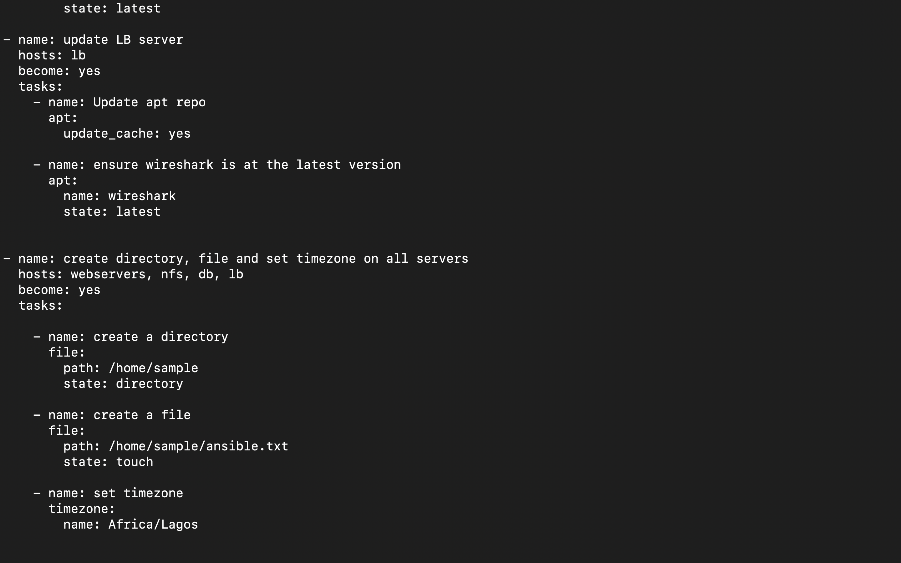

**Step 6 - Update GIT with the latest code**

Now all of your directories and files live on machine and need to push changes made locally to GitHub.

Also on our separate branch, you will need to know how to raise a ***Pull Request(PR)***, get your branch peer and merged to the `main` branch.

Commit your code into GitHub:

1. Use git commands to add, commit and push your branch to GitHub.

`git status`

`git add `

`git commit -m "commit message"`

2. Create a Pull request(PR)

3. Wear the hat of another developer for a second, and act as a reviewer.

4. If the reviewer is happy with your new feature development, merge the code to the `merge` branch.

5. Head back on your terminal, checkout from the feature branch in to the `main`, and pull down the latest changes. 

Once your code changes appears in `main` branch - Jenkins will do its jobs and save all the files(build artifacts) to `/var/lib/jenkins/jobs/ansible/builds/<build_number>/archive/` directory on Jenkins-Ansible server. 


**Run first ansible test**

**Step 7 - Run First Ansible test**

Now, it is time to execute `ansible-playbook` command and verify if your playbook actually works:

1. Setup your VSCode to connect to your instance and run your playbook using the comands below;

`cd ansible-config-mgt`

`ansible-playbook -i inventory/dev.yml playbooks/common.yml`

**Note**: Make sure you are in your `ansible-config-mgt` directory before you run the above command. 

You can go to each of the servers and check if `wireshark` has been installed by running `which wireshark` or `wireshark --version`

We test randomly, to see if wireshark is installed in our servers. Here is for lb, webserver-1 and nfs server;

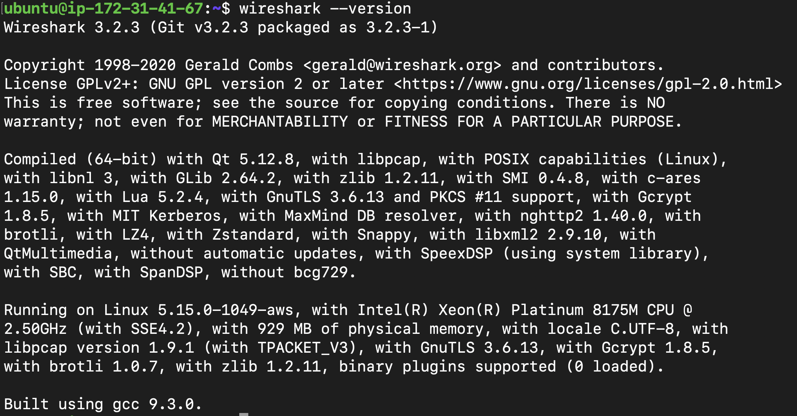

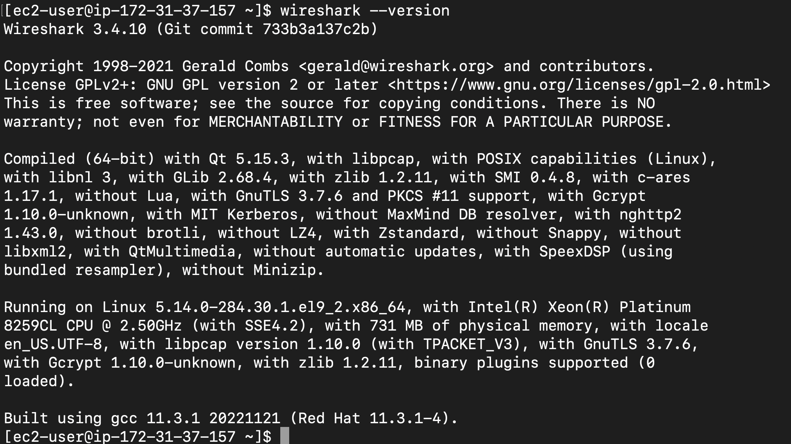

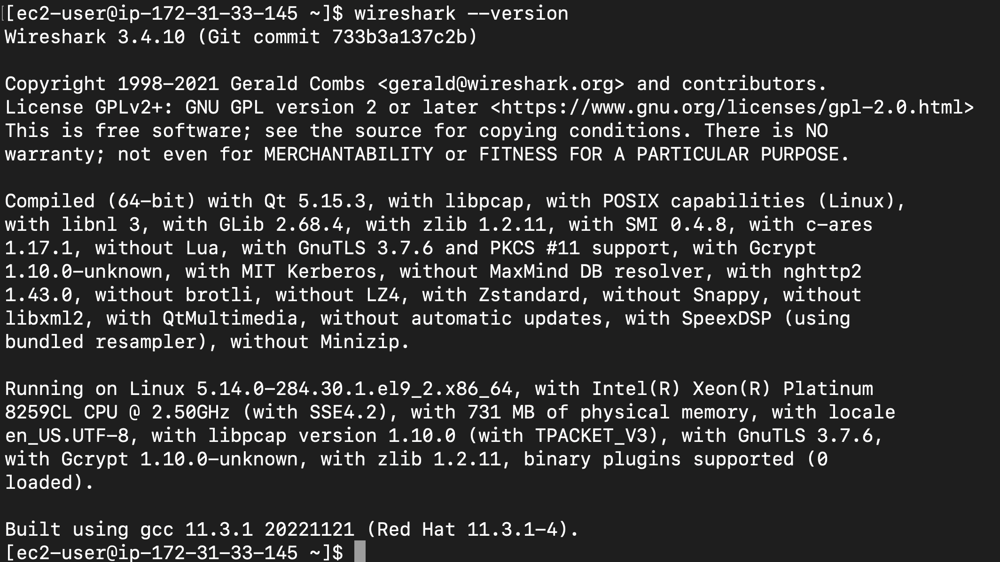

#### Optional Step - Repeat once again

Update your ansible playbook with some new ansible tasks and go through the full `checkout -> change codes -> commit -> PR -> merge -> build -> ansible-playbook` cycle again to see how easily you can manage a servers fleet of any size with just one command. 

The playbook ran successfully;

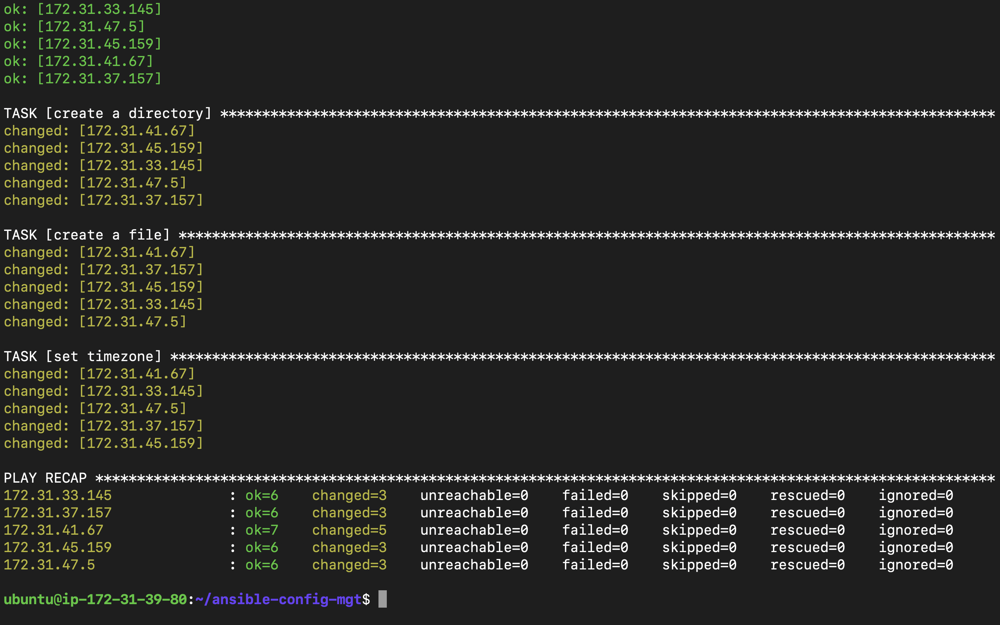

Results when we test randomly;

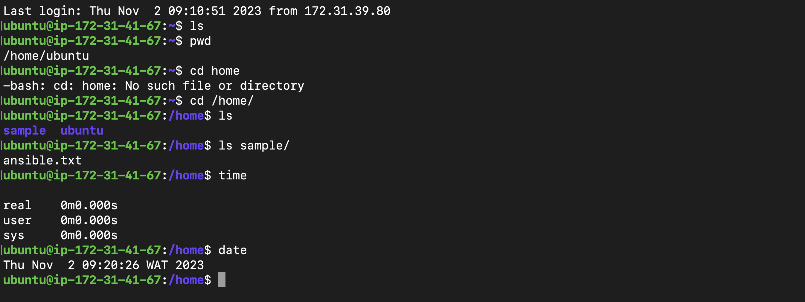

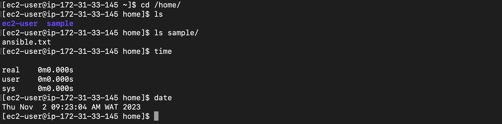

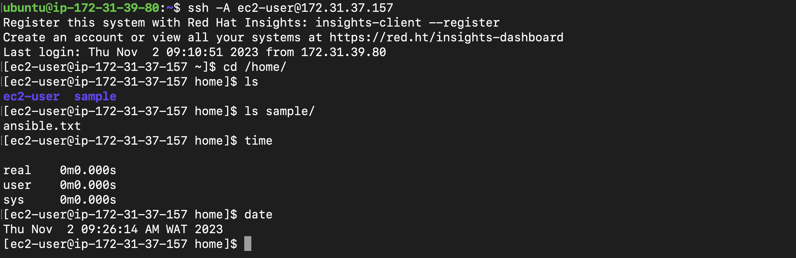


