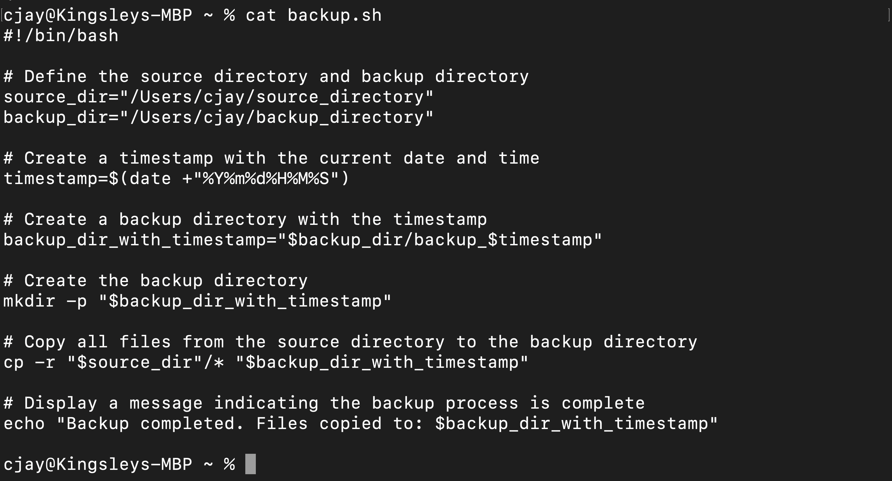

# Shell Scripting Hands-On Project

## Introduction to Shell Scripting and User Input

We can simply define shell script as a ***test file*** that contains series of command of an operating system. It most commonly used to automate repetitive tasks. The file is denonated with the .sh extension. These scripts can be executed directly from the comand line or called from other scripts.

Firstly, to know the location of your shell, you run the follwing command:

`echo $SHELL`


## Shell Scripting Syntax Elements

1. **Variables**: Bash allows you to define and work with variables. Variables can store data of various types such as nummbers,strings and arrays. You can assign values to variables using the operator, and access their values using the variable name preceded by a $ sign.

**Example**: Assigning a ***variable***:

`name="Kingsley"`

**Example**: Retrieving value from a ***variable***

`echo $name`


2. **Control Flow**: Bash provides control flow statements like if-else,for loops and case statements to control the flow of execution in your scripts. 

**Example**: Using ***if-else*** to execute script based on condition

```php
#!/bin/bash

# Example script to check if a number is positive, negative, or zero

read -p "Enter a number: " num

if [ $num -gt 0 ]; then
    echo "The number is positive."
elif [ $num -lt 0 ]; then
    echo "The number is negative."
else
    echo "The number is zero."
fi
```


**Example**: Iterating through a list using a ***for loop***

```php
#!/bin/bash

# Example script to print numbers from 1 to 5 using a for loop

for (( i=1; i<=5; i++ ))
do
    echo $i
done
```


3. **Command Substitution**: This allows you to capture the output of a command and use it as a value within your script. You ncan use the backtick or the $()syntax for command substitution.

**Example**: Using backtick for command substitution

```php
current_date=`date +%Y-%m-%d`
```
**Example**: Using $()syntax for command substitution

```php
current_date=$(date +%Y-%m-%d)
```

4. **Input and Output**: Bash provides various ways to handle input and output. You can use the read command to accept user input, and output text to the console using the echo command. You can as well redirect input and output using the operators like >(output to a file), <(input from a file), and | (pipe the output of one command as input to another)

**Example**: Accept user input

```php
echo "Enter your name:"
read name
```
**Example**: Output text to the terminal

```php
echo "Hello World"
```
**Example**: Out the result of the command into a file 

`echo "Hello World" > index.txt`


**Example**: Pass the content of a file as input to a command 

`grep "pattern" < input.txt`

**Example**: Pass the result of a command as input to another command

`echo "Hello World" | grep "pattern"`


5. **Functions**: Bash allows you to define and use function to group related commands together. Functions provide a way to modularize your code and make it more reusable. You can define function using the function keyword or simply by declaring the function name followed by parentheses.

```php
#!/bin/bash

# Define a function to greet the user
greet() {
    echo "Hello, $1! Nice to meet you."
}

# Call the greet function and pass the name as an argument
greet "John"
```


## Lets write our First Shell Script

**step 1**: On your terminal, create a folder called ***shell-scripting*** `mkdir shell-scripting`. This will hold all the script we will write in this lesson.

**step 2**: create a file called ***user-input.sh***using the command `touch user-input.sh`

**step 3**: inside the file we write following block of code:
```php
#!/bin/bash

# Prompt the user for their name
echo "Enter your name:"
read name

# Display a greeting with the entered name
echo "Hello, $name! Nice to meet you."
```

**step 4**: save your file

**step 5**: Run the command `sudo chmod u+x user-input.sh` this makes the file executable

**step 6**: Run the script using the command ./user-input.sh

Below is how it looks:


## Directory Manipulation and Navigation

We write a script that will display the current directory called "my_directory",change to that directory, create two new files inside it, list the files, move back one level up, remove the "my_directory" and its contents and finally list the files in the current directory again.

**step 1**: open a file named ***navigating-linux-filesystem.sh***

**step 2**: paste the code block below into the file.
```php
#!/bin/bash

# Display current directory
echo "Current directory: $PWD"

# Create a new directory
echo "Creating a new directory..."
mkdir my_directory
echo "New directory created."

# Change to the new directory
echo "Changing to the new directory..."
cd my_directory
echo "Current directory: $PWD"

# Create some files
echo "Creating files..."
touch file1.txt
touch file2.txt
echo "Files created."

# List the files in the current directory
echo "Files in the current directory:"
ls

# Move one level up
echo "Moving one level up..."
cd ..
echo "Current directory: $PWD"

# Remove the new directory and its contents
echo "Removing the new directory..."
rm -rf my_directory
echo "Directory removed."

# List the files in the current directory again
echo "Files in the current directory:"
ls
```

**step 3**: Run the command `sudo chmod u+x navigating-linux-filesystem.sh` to execute permission on the file

**step 4**: Run your script using the command `./navigating-linux-filesystem.sh`


## File Operations and Sorting

We'll be writing a simple shell script that focuses on ***File Operations and Sorting***.

This script creates three files(file1.txt,file2.txt and file3.txt), displays the files in their current order, sorts them alphabetically, saves the sorted files in sorted_files.txt, displays the sorted files, removes the original files, renames the sorted file to sorted_files_sorted_alpahabetically.txt and finally dispalys the contents of the final sorted file.

We proceeed with the following steps below;

**step 1**: In your terminal, create a file called ***sorting.sh*** using the command `touch sorting.sh`

**step 2**: Copy and paste the block of code below into the file 
```php
#!/bin/bash

# Create three files
echo "Creating files..."
echo "This is file3." > file3.txt
echo "This is file1." > file1.txt
echo "This is file2." > file2.txt
echo "Files created."

# Display the files in their current order
echo "Files in their current order:"
ls

# Sort the files alphabetically
echo "Sorting files alphabetically..."
ls | sort > sorted_files.txt
echo "Files sorted."

# Display the sorted files
echo "Sorted files:"
cat sorted_files.txt

# Remove the original files
echo "Removing original files..."
rm file1.txt file2.txt file3.txt
echo "Original files removed."

# Rename the sorted file to a more descriptive name
echo "Renaming sorted file..."
mv sorted_files.txt sorted_files_sorted_alphabetically.txt
echo "File renamed."

# Display the final sorted file
echo "Final sorted file:"
cat sorted_files_sorted_alphabetically.txt
```

**step 3**: Set execute permission on ***sorting.sh*** using the command `sudo chmod u+x sorting.sh`

**step 4**: Run the script with the command `./sorting.sh`


## Working with Numbers and Calculations 

This script defines two variables num1 and num2 with numeric values, performs basic arithemetic operations(addition, subtraction,multiplication and modulus), and displays the results. It also performs more complex calculations such as raising num1 to the power of 2 and calculation the squaroot of num2 and displays the result as well.

Lets proceed by following the steps below:

**step 1**: We create a file ***calculation.sh***on the terminal by running the command `touch calculation.sh`  

**step 2**: Copy and paste the code block below:
```php
#!/bin/bash

# Define two variables with numeric values
num1=10
num2=5

# Perform basic arithmetic operations
sum=$((num1 + num2))
difference=$((num1 - num2))
product=$((num1 * num2))
quotient=$((num1 / num2))
remainder=$((num1 % num2))

# Display the results
echo "Number 1: $num1"
echo "Number 2: $num2"
echo "Sum: $sum"
echo "Difference: $difference"
echo "Product: $product"
echo "Quotient: $quotient"
echo "Remainder: $remainder"

# Perform some more complex calculations
power_of_2=$((num1 ** 2))
square_root=$(awk "BEGIN{ sqrt=$num2; print sqrt }")

# Display the results
echo "Number 1 raised to the power of 2: $power_of_2"
echo "Square root of number 2: $square_root"
```
**step 3**: Set execute permission on ***calculation.sh*** using the command: `sudo chmod u+x calculation.sh`

**step 4**: Run your script using the command `./calculation.sh`


## File Backup and Timestamping

This script defines the source directory and backup directory paths. It then creates a timestamp using the current date and time, and creates a backup directory with the timestamp appended to its name. The script then copies all files from the source directory to the backup directory using the cp command and with the -r option for recursive copying. Finally, it displays a message indicating the completion of the backup process and showsn the path of the backup directory with the timestamp.

Lets proceed using the steps below:

**step 1**: On your terminal open a file ***backup.sh*** using the command `touch backup.sh` 


**step 2**: Copy and paste the code block below into the file.
```php
#!/bin/bash

# Define the source directory and backup directory
source_dir="/path/to/source_directory"
backup_dir="/path/to/backup_directory"

# Create a timestamp with the current date and time
timestamp=$(date +"%Y%m%d%H%M%S")

# Create a backup directory with the timestamp
backup_dir_with_timestamp="$backup_dir/backup_$timestamp"

# Create the backup directory
mkdir -p "$backup_dir_with_timestamp"

# Copy all files from the source directory to the backup directory
cp -r "$source_dir"/* "$backup_dir_with_timestamp"

# Display a message indicating the backup process is complete
echo "Backup completed. Files copiedh_timestamp"
```

`cat backup.sh`



**step 3**: Set execute permission on ***backup.sh*** using the command `sudo chmod u+x backup.sh`

**step 4**: Run your script using the command : `./backup.sh` 


